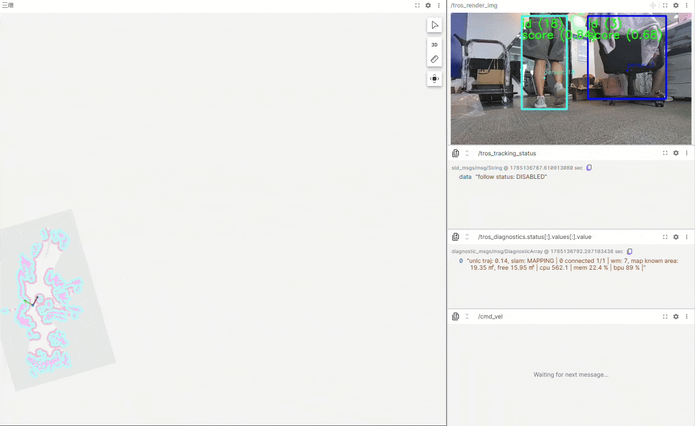

# tros_person_following



> 完整的人体跟随效果： [vims_person_tracking.mp4](https://archive.d-robotics.cc/TogetheROS/files/vision_mobile_solution/images/vims_person_tracking.mp4)

ROS2 人体跟随控制节点。订阅 AI 感知结果（`ai_msgs::msg::PerceptionTargets`），从中选取目标人体，通过 Nav2 `NavigateToPose` action 自主导航跟随，实现机器人对人体目标的自动跟踪。含目标丢失恢复（belief search）、边缘转向（edge-turn）、静止目标切换、轨迹预测等能力。

> 目标丢失后的恢复流程（LOST 状态机、belief search、relock 距离门控、edge-turn 等）详见 [docs/LOST_REACQUIRE_FLOW.md](docs/LOST_REACQUIRE_FLOW.md)。

## 功能概述

### 跟踪状态机

节点核心是一个三状态有限状态机：

```
IDLE ──(检测到有效 moving 目标)──> TRACKING ──(连续丢失超过阈值)──> LOST ──(超时)──> IDLE
                                        ^                              |
                                        └──(重新发现同一 id / 接受新目标)┘
```

- **IDLE**：未跟踪任何目标。超时无目标时原地旋转搜索；旋转超过总时长上限后停止。出现 valid+moving 目标则进 TRACKING（含观察期：静止目标先观察一段时间看是否移动）。
- **TRACKING**：正在跟踪目标（按 `track_id` 匹配）。根据 robot↔target 距离决定停车 / withhold / 跟随。跟踪过程中**不过滤** confidence。
- **LOST**：目标丢失。优先找回原 id（FLOW 7），其次接受 LKP 附近的新 moving 目标（FLOW 8）；同时跑 belief search（预测点优先 + LKP 附近观测点扫描）主动恢复。超时（搜索不激活时）回 IDLE。

### 目标选择策略（IDLE 状态）

在 IDLE 状态选择跟踪目标时，依次经过以下过滤：

1. **类型过滤**：仅接受 `type == "person"` 且含有位置属性的目标
2. **尺寸过滤**：`width < target_filter_width_thr || height < target_filter_height_thr` 的目标丢弃
3. **范围过滤**：超出 `[target_filter_range_x_min, target_filter_range_x_max] × [target_filter_range_y_min, target_filter_range_y_max]` 的目标丢弃
4. **置信度过滤**：`confidence < target_filter_confidence_thr` 的目标丢弃（垃圾过滤）
5. **移动判定**：moving 候选（窗口内世界位移 > `static_target_move_thr`）才进下一步
6. **质量门槛**：moving 候选 `confidence < select_min_confidence` 不选（继续 spin 找高质量目标）
7. **打分选择**：在合格 moving 候选里按 `dist + confidence + center` 加权分最高者跟随

### 跟随距离带（TRACKING 期）

按 robot↔target 地图距离分三段（含 max 边界迟滞，防抖动）：

| 距离区间 | 行为 |
|---|---|
| `dist < follow_distance_min` | 停车：cancel nav + 零速硬停（边缘 + edge-turn 转向） |
| `follow_distance_min ≤ dist ≤ follow_distance_max`（迟滞区内保持） | withhold：不发 nav、不 cancel，沿用上一帧 |
| `dist > follow_distance_max`（迟滞区内保持） | 跟随：发 NavigateToPose 朝目标位置走 |

- 仅当目标位姿与当前/上次 nav goal 的平移差 > `follow_goal_dist_deadzone` 或角度差 > `follow_goal_yaw_deadzone` 时才发/重发 nav goal
- 目标移动超阈值时取消当前 nav 并发新 goal（受 `follow_goal_pub_rate` 限频）
- max 边界迟滞 `follow_hysteresis`：进 follow 需 `dist > max+hyst`，退 follow 需 `dist < max-hyst`，防边界抖动 send/cancel churn

### 边缘转向（edge-turn）

目标 ROI 贴近画面左右边缘且 `dist < follow_distance_min` 时，原地发 `cmd_vel` 角速度转向目标（不走 Nav2），把目标拉回画面中心。详见 LOST 文档"TRACKING 期边缘转向子流程"。

### 盲区观测联动

- 进入 TRACKING 状态时发布 `enable_blind_zone_observing: false`，暂停盲区观测
- 进入 LOST 或 IDLE 状态时发布 `enable_blind_zone_observing: true`，恢复盲区观测

### 蜂鸣器状态提示

通过蜂鸣器提醒**被跟踪人**当前跟踪状态（依赖 `originbot_base` 提供的 `/buzzer_pattern` 声音库，本节点只决定"何时响"）：

- **仅 `TRACKING → LOST` 转换响一声**（pattern 1 = 1 短声）：目标丢失时提醒被跟踪人"机器人丢你了"。
- **进入 TRACKING（锁定 / 重锁 / 切目标）不响**：避免锁定/重锁频繁发声吵人。
- **`→ IDLE`（放弃 / 停止）静默**。
- 节流：`buzzer_min_interval_sec` 秒内不重复发声，压制检测闪烁导致的 `TRACKING ↔ LOST` 快速震荡 chatter（详见参数说明）。
- 注意：依赖 `originbot_base` 新二进制（含 `/buzzer_pattern` 订阅解码发声）同板在线，否则本节点发的 pattern 无人解码、不响。

## 编译与运行

### 编译

```bash
# 源码环境
source /opt/tros/humble/local_setup.bash

# 编译本包
colcon build --packages-select tros_person_following

# 编译本包及其依赖
colcon build --packages-up-to tros_person_following
```

### 运行

通过 launch 文件启动（含 obstacle_depth_fusion + MOT + person_following 完整链路）。

```
perception ──> fusion ──> MOT ──> person_following ──> Nav2
                 ^
                 |
     depth ──────┘
```

```bash
source /opt/tros/humble/local_setup.bash
export ROS_LOG_DIR=/userdata/.ros

ros2 launch tros_person_following tros_person_following.launch.py
```

常用启动参数（可用 `ros2 launch ... <参数>:=<值>` 覆盖，完整参数见下文"参数说明"）：

| 参数 | 默认 | 说明 |
|---|---|---|
| `log_level` | info | 日志级别（debug/info/warn/error） |
| `enable_perc_render` | False | 是否启动感知渲染节点（把感知结果画到图像上发布 `/tros_render_img`）。`True` 时 websocket 自动显示渲染图，`False` 时显示原始 `/image_jpeg` |
| `enable_websocket` | True | 是否启动 websocket 渲染节点（网页端看图） |
| `mot_config` | `<share>/config/iou2_method_param.json` | MOT 配置 json 路径，默认用本包自带配置 |
| `follow_distance_min` / `follow_distance_max` | 1.8 / 2.0 | 跟随距离带（停车/withhold/跟随） |
| `target_filter_confidence_thr` / `select_min_confidence` | 0.5 / 0.7 | 目标过滤/选择的置信度门槛 |

带感知渲染 + 调试日志的启动示例：

```bash
ros2 launch tros_person_following tros_person_following.launch.py \
  enable_perc_render:=True log_level:=debug
```

### 启停跟随

节点启动后默认**不跟随**（`follow_enabled_=false`，忽略所有检测），需通过 `/enable_follow` service 显式开启。运行中可随时启停。

**开启跟随**：

```bash
ros2 service call /enable_follow std_srvs/srv/SetBool "{data: true}"
```

开启后：进入 IDLE 搜索目标 → 检测到 valid+moving 目标进 TRACKING → 按 `follow_distance_min/max` 跟随。状态发布在 `/tros_tracking_status`（latched，可随时查当前状态）：

```bash
ros2 topic echo /tros_tracking_status --once
```

**停止跟随**：

```bash
ros2 service call /enable_follow std_srvs/srv/SetBool "{data: false}"
```

停止后：cancel 当前 nav goal、停 spin、回 IDLE、`follow_enabled_=false` 忽略检测，机器人原地不动。

### 话题

| 方向 | 话题 | 类型 | 说明 |
|------|------|------|------|
| 订阅 | `/tros_mot_targets` | `ai_msgs/msg/PerceptionTargets` | MOT 跟踪后的感知结果 |
| 订阅 | `/global_costmap/costmap` | `nav_msgs/msg/OccupancyGrid` | 全局 costmap（free 判定 / 观测点 BFS） |
| 发布 | `nearest_pose` | `geometry_msgs/msg/PoseStamped` | 跟踪目标的目标位姿（调试/可视化） |
| 发布 | `tros_tracking_status` | `std_msgs/msg/String` | 跟随状态 / FLOW 链路（latched） |
| 发布 | `tros_followed_target_pose` | `geometry_msgs/msg/PoseStamped` | 跟踪目标 map 系位姿（每帧） |
| 发布 | `tros_person_followed` | `ai_msgs/msg/PerceptionTargets` | 跟踪目标信息（track_id+rois+状态） |
| 发布 | `predict_trajectory` | `nav_msgs/msg/Path` | 预测轨迹 / belief 搜索路径（RViz） |
| 发布 | `enable_blind_zone_observing` | `std_msgs/msg/Bool` | 盲区观测使能 |
| 发布 | `/buzzer_pattern` | `std_msgs/msg/UInt8` | 蜂鸣器状态提示（pattern id，`originbot_base` 解码发声；仅 TRACKING→LOST 发 1） |
| 发布 | `/cmd_vel` | `geometry_msgs/msg/Twist` | 原地旋转 / 停车（绕过 Nav2） |
| 客户端 | `navigate_to_pose` | `nav2_msgs/action/NavigateToPose` | Nav2 导航 Action |
| 服务 | `enable_follow` | `std_srvs/srv/SetBool` | 启停跟随 |

## 参数说明

参数按功能分组（与代码 declare 顺序一致）。运行时可用 `ros2 launch ... <参数名>:=<值>` 覆盖。

### Topics & Frames — 话题与坐标系

| 参数 | 类型 | 默认值 | 说明 |
|------|------|--------|------|
| `detect_result_topic_name` | string | `/tros_mot_targets` | 感知结果订阅话题 |
| `goal_pose_topic_name` | string | `nearest_pose` | 目标位姿发布话题 |
| `global_frame` | string | `map` | 全局坐标系 |
| `robot_frame` | string | `base_footprint` | 机器人坐标系 |
| `followed_target_topic` | string | `tros_person_followed` | 跟踪目标信息话题 |
| `followed_target_pose_topic` | string | `tros_followed_target_pose` | 跟踪目标位姿话题 |
| `cmd_vel_topic` | string | `/cmd_vel` | 原地旋转/停车 cmd_vel 话题 |
| `costmap_topic` | string | `/global_costmap/costmap` | 全局 costmap 订阅话题 |

### Target filtering — IDLE 期目标过滤

| 参数 | 类型 | 默认值 | 说明 |
|------|------|--------|------|
| `target_filter_width_thr` | float | 0.3 | 最小人体宽度（m），低于此值丢弃 |
| `target_filter_height_thr` | float | 0.5 | 最小人体高度（m），低于此值丢弃 |
| `target_filter_confidence_thr` | float | 0.5 | 最小置信度（垃圾过滤），低于此值在 IDLE 不跟踪 |
| `target_filter_range_x_min` | float | 0.1 | 有效范围 X 最小值（m，相机前方） |
| `target_filter_range_x_max` | float | 4.0 | 有效范围 X 最大值（m） |
| `target_filter_range_y_min` | float | -3.0 | 有效范围 Y 最小值（m，相机左侧） |
| `target_filter_range_y_max` | float | 3.0 | 有效范围 Y 最大值（m） |

### Target selection — IDLE 期目标选择

| 参数 | 类型 | 默认值 | 说明 |
|------|------|--------|------|
| `select_min_confidence` | double | 0.7 | 严苛置信度门槛：moving 候选 conf 低于此值不选（继续 spin 找高质量目标） |
| `select_weight_dist` | float | 0.5 | 打分：距离权重（越近分越高） |
| `select_weight_score` | float | 0.3 | 打分：置信度权重 |
| `select_weight_center` | float | 0.2 | 打分：画面居中度权重 |

### Follow distance band — 跟随距离带

| 参数 | 类型 | 默认值 | 说明 |
|------|------|--------|------|
| `follow_distance_min` | double | 1.8 | dist<min：停车（cancel+零速+edge-turn 条件） |
| `follow_distance_max` | double | 2.0 | dist>max：跟随（发 NavigateToPose）；中间为 withhold |
| `follow_hysteresis` | double | 0.1 | max 边界迟滞（m）：进 follow 需 >max+hyst，退需 <max-hyst，防 churn |
| `follow_min_safe_distance` | double | 0.5 | 相机 X 方向硬停距离（m） |
| `follow_goal_pub_rate` | double | 2.5 | Nav2 goal 时间限频（Hz）：即使目标在动，最快每 1/rate 秒发一次，防 Nav2 planner churn。目标快走跟不上可调大（如 3.0）；Nav2 报 tick-rate exceeded/超时可调小（如 1.5） |
| `follow_goal_dist_deadzone` | float | 0.3 | Nav2 goal 空间死区-位移（m）：goal 位置变化小于此值不发/重发 nav。机器人跟随抖动可调大（如 0.5）；跟随迟钝可调小 |
| `follow_goal_yaw_deadzone` | float | 0.6 | Nav2 goal 空间死区-角度（rad，约 34°）：goal 朝向变化小于此值不发/重发 nav。与 dist_deadzone 任一超阈值即触发重发 |

> 三个 `follow_goal_*` 参数控制"跟随时 Nav2 goal 的发送节奏"（与 `follow_distance_min/max` 的"是否跟随"开关正交）：空间死区（dist/yaw）决定 goal 变多少才发，时间限频（pub_rate）决定多久才发一次。三者叠加——goal 变化够大且距上次够久才发新 nav。

### Edge-of-frame turn — 边缘转向

| 参数 | 类型 | 默认值 | 说明 |
|------|------|--------|------|
| `image_width` | double | 640 | 相机图像宽度（px，ROI 边缘判定） |
| `edge_margin_ratio` | double | 0.15 | 左右边缘带占比（×image_width） |

### Stationary-target switch — 静止目标切换

跟踪目标 A 静止超 `static_target_timeout_sec` 时，在画面里找"与 A 深度相近且自身在动"的候选 B（选活动度最高的），切换跟随 B，避免机器人停在原地跟一个不动的人。

| 参数 | 类型 | 默认值 | 说明 |
|------|------|--------|------|
| `static_target_timeout_sec` | double | 5.0 | 跟踪目标 A 静止（窗口内位移 < `static_target_move_thr`）超此时长（s）→ 触发切换，去找附近活动目标 B |
| `static_target_move_thr` | double | 0.1 | "静止"判定阈值（m）：窗口内世界位移 < 此值视为静止（A 满足此才触发切换；B 须移动 > 此值才算活动） |
| `static_switch_depth_diff_thr` | double | 0.3 | 候选 B 与 A 的相机前向深度差阈值（m）：\|B.x_m - A.x_m\| > 此值的 B 不算"附近"（跳过），只在与 A 深度相近的人里选 B，防切到远处路人。调大→候选范围更宽（更易切）；调小→只切紧挨 A 的人 |
| `static_switch_activity_window_sec` | double | 1.0 | 测量目标活动度的窗口（s）：用最近 `targetMovementOverWindow(id, 此值)` 算世界位移。既判 A 是否静止（与 `static_target_timeout_sec` 取较大窗口），也判 B 是否活动、选活动度最高的 B。调大→更平滑（短期抖动不算动）；调小→更灵敏（轻微移动即判活动） |

### Prediction — LOST 后轨迹预测

| 参数 | 类型 | 默认值 | 说明 |
|------|------|--------|------|
| `predict_window_sec` | double | 6.0 | 速度估计窗口（s） |
| `predict_lead_sec` | double | 2.0 | 前瞻外推时长（s，外推 v×(since+lead)） |
| `predict_max_dist` | double | 3.0 | 外推位移上限（m，超出按比例缩放） |
| `predict_stale_sec` | double | 10.0 | 最新样本超此年龄（s）则不预测 |

### IDLE search & observe — IDLE 搜索 / 观察 / 原地旋转

| 参数 | 类型 | 默认值 | 说明 |
|------|------|--------|------|
| `idle_search_start_timeout_sec` | float | 3.0 | IDLE 多久无目标开始旋转搜索（s） |
| `idle_search_total_timeout_sec` | float | 60.0 | IDLE 搜索总时长上限（s，超时停 spin） |
| `idle_observe_duration_sec` | double | 1.0 | 观察 valid-but-not-moving 候选的时长（s） |
| `observe_cooldown_sec` | double | 3.0 | 观察超时后跳过再观察的冷却（s），让 spin 真转起来 |
| `spin_radian` | float | 3.14 | 每次原地旋转角度（rad） |
| `explore_spin_angular_speed` | double | 0.8 | 原地旋转角速度（rad/s） |

### LOST recovery / belief search / relock — LOST 恢复 + 信念搜索 + 重锁

| 参数 | 类型 | 默认值 | 说明 |
|------|------|--------|------|
| `tracking_to_lost_timeout_sec` | float | 2.0 | TRACKING 连续丢失超此时长（s）→ 进 LOST |
| `lost_to_idle_timeout_sec` | float | 1.0 | LOST 持续超此时长（s，belief 未激活时）→ IDLE |
| `belief_search_timeout_sec` | double | 8.0 | belief search 总超时（s） |
| `belief_search_max_rounds` | int | 2 | belief search 最大迭代轮数 |
| `relock_dist_phase1` | double | 1.0 | t<phase1_sec 时 relock 距离阈值（m，严格） |
| `relock_dist_phase2` | double | 2.0 | phase1_sec≤t<phase2_sec 时阈值（m，中等） |
| `relock_dist_phase3` | double | 3.0 | t≥phase2_sec 时阈值（m，宽松） |
| `relock_dist_phase1_sec` | double | 2.0 | phase1→phase2 切换点（s） |
| `relock_dist_phase2_sec` | double | 5.0 | phase2→phase3 切换点（s） |

### Costmap — costmap free 判定

| 参数 | 类型 | 默认值 | 说明 |
|------|------|--------|------|
| `costmap_free_cost_thr` | double | 50.0 | cell cost 低于此值视为 free |
| `costmap_free_search_radius_m` | double | 2.0 | 人附近 BFS 最近 free cell 的半径（m） |

### 蜂鸣器 — 跟踪状态提示

| 参数 | 类型 | 默认值 | 说明 |
|------|------|--------|------|
| `buzzer_min_interval_sec` | double | 3.0 | 蜂鸣器最小发声间隔（秒）。`>0` 距上次发声不足该值则跳过（压 `TRACKING↔LOST` 闪烁 chatter）；`==0` 不限制（每次 `TRACKING→LOST` 都响）；`<0` 完全禁用（不发任何蜂鸣器控制消息）。仅 `TRACKING→LOST` 响 1 声（pattern 1），进入 TRACKING 不响。 |

### Launch 文件额外参数（控制链路中其他节点）

| 参数 | 类型 | 默认值 | 说明 |
|------|------|--------|------|
| `depth_fusion_detect_input_width` | int | 640 | 深度融合节点输入图像宽度 |
| `depth_fusion_detect_input_height` | int | 352 | 深度融合节点输入图像高度 |
| `mot_sub_topic` | string | `/tros_fusion_interaction` | MOT 节点订阅话题 |
| `mot_pub_topic` | string | `/tros_mot_targets` | MOT 节点发布话题 |
| `mot_config` | string | `<share>/config/iou2_method_param.json` | MOT 配置 json 路径（本包自带，可调 MOT 参数） |
| `enable_perc_render` | bool | False | 是否启动感知渲染节点 |
| `enable_websocket` | bool | True | 是否启动 WebSocket 渲染节点 |

## 调参指南

### 目标检测过于灵敏 / 跟踪到误检

- **增大 `target_filter_confidence_thr`**（如 0.6~0.8）：过滤低置信度检测，减少误跟
- **增大 `target_filter_height_thr` / `target_filter_width_thr`**：过滤尺寸过小的误检
- **增大 `select_min_confidence`**（如 0.75）：选目标时更严苛，只跟高质量目标
- **缩小 `target_filter_range_x_max`**：减少远处误检干扰

### 跟踪目标频繁丢失

- **增大 `tracking_to_lost_timeout_sec`**（如 3.0~5.0）：容忍更长的目标消失时间，避免短暂遮挡进 LOST
- **增大 `lost_to_idle_timeout_sec`**：LOST 等更久再回 IDLE（注意 belief search 激活时此超时挂起）

### 跟随距离不合适

- **机器人跟得太近**：增大 `follow_distance_min`（如 2.0），让机器人更早停车
- **机器人跟得太远**：减小 `follow_distance_max`（如 1.5），让机器人更早开始跟随
- **距离边界抖动（nav 反复发 cancel/send）**：增大 `follow_hysteresis`（如 0.2），扩大滞回区
- **机器人不停调整位置（抖动）**：增大 `follow_goal_dist_deadzone` 和 `follow_goal_yaw_deadzone`，减少小幅 goal 变化触发重发
- **目标快走、机器人跟不上**：增大 `follow_goal_pub_rate`（如 3.0~4.0 Hz），更频繁更新 nav goal
- **Nav2 报 tick-rate exceeded / ComputePathToPose 超时**：减小 `follow_goal_pub_rate`（如 1.5 Hz），减轻 Nav2 planner 压力

### 蜂鸣器

- **响太频繁 / 嗡鸣**：增大 `buzzer_min_interval_sec`（如 4.0~5.0），拉长两次发声最小间隔
- **丢失了没及时响**：减小 `buzzer_min_interval_sec`（如 1.5~2.0），但别低于 chatter 周期否则回嗡鸣
- **完全不要响**：设 `buzzer_min_interval_sec:=-1.0`（禁用，不发蜂鸣器消息）
- **每次丢失都响（不限频）**：设 `buzzer_min_interval_sec:=0.0`（chatter 时会嗡鸣，仅调试用）
- 注意：只在 `TRACKING → LOST` 响 1 声；进入 TRACKING 不响是设计如此，不是 bug

### 搜索行为

- **旋转搜索太慢**：增大 `spin_radian` 或 `explore_spin_angular_speed`，每次转更大角度 / 更快
- **搜索超时太短**：增大 `idle_search_total_timeout_sec`，延长搜索时间
- **等待太久才开始旋转**：减小 `idle_search_start_timeout_sec`，更快开始搜索
- **观察期卡住反复观察同一静止目标**：增大 `observe_cooldown_sec`，冷却期内跳过观察让 spin 转起来

### LOST 恢复

- **LOST 后锁错目标**：减小 `relock_dist_phase1`（如 0.5），早期更严格只接受 LKP 极近的重锁
- **LOST 后找不到目标**：增大 `relock_dist_phase3`（如 5.0）或 `belief_search_max_rounds`，放宽晚期 / 多搜几轮
- 详见 [docs/LOST_REACQUIRE_FLOW.md](docs/LOST_REACQUIRE_FLOW.md)

### 检测范围

- **侧方目标漏检**：增大 `target_filter_range_y_min` 的绝对值 / 增大 `target_filter_range_y_max`（如 -4.0~4.0）
- **远处目标不需要**：减小 `target_filter_range_x_max`，缩小关注范围

### 典型参数场景

**室内近距离跟随**：
```
target_filter_range_x_max:=1.5 follow_distance_min:=0.8 follow_distance_max:=1.5
```

**室外远距离跟随**：
```
target_filter_range_x_max:=4.0 target_filter_range_y_min:=-4.0 target_filter_range_y_max:=4.0
follow_distance_min:=1.5 follow_distance_max:=3.0 target_filter_confidence_thr:=0.6
```

**高精度跟踪（减少误跟）**：
```
target_filter_confidence_thr:=0.7 target_filter_width_thr:=0.4 target_filter_height_thr:=0.3
select_min_confidence:=0.8 tracking_to_lost_timeout_sec:=3.0
```

## MOT 配置

本包自带 MOT 配置 `config/iou2_method_param.json`（从 hobot_mot 拷贝），launch 启动 mot 时传该路径。调 MOT 参数（如 `iou_thres`/`missing_time_thres`/`min_score`）直接改本包的 json 后重编即可，无需跨包改 hobot_mot。临时覆盖：

```
ros2 launch tros_person_following tros_person_following.launch.py mot_config:=/abs/path/other.json
```

## 改进建议

针对不同场景与跟随要求，可在现有逻辑之上做以下改进。当前实现基于视觉 MOT（track_id + 相机系 xy）+ Nav2，视觉遮挡/出画面即 LOST；以下方向按工程量由小到大排列，供选型参考。

### 调参级（零代码）

- **缩短 LOST 延迟**：减小 `tracking_to_lost_timeout_sec`（如 1.0~1.5），目标短暂遮挡更快进 LOST 触发恢复；减小 `lost_to_idle_timeout_sec` 更快回 IDLE 重搜。
- **收紧/放宽 relock**：`relock_dist_phase1/2/3` 控制重锁严格度——人群场景收紧防跟错，空旷场景放宽防丢原目标。
- **搜索节奏**：增大 `explore_spin_angular_speed` / `spin_radian` 加快 IDLE 旋转搜索；调 `belief_search_max_rounds` 增减 belief 搜索轮数。
- **边缘挽留**：`edge_margin_ratio` 调小（如 0.1）让目标更贴近边缘才转向，减少不必要的转向；调大则更早挽留。

### 算法级（改检测/跟踪链路）

- **更强的目标检测**：替换/升级感知模型（更高置信度、更小目标检测能力），从源头降低误检漏检——直接提升 `target_filter_confidence_thr` / `select_min_confidence` 的可用区间。
- **ReID 特征辅助**（远期）：目标 lost 后若重新出现但 MOT 重新分配了 track_id，用人体外观特征（ReID，如 OSNet）判定是否同一人，避免"跟错/丢原目标"。需引入 ReID 推理 + 特征库管理，工程量较大。MOT 包已预留 `reid_method_param.json` 配置（当前未编译），可作为切入点。
- **多帧确认切目标**：LOST 期接受新目标时要求连续 N 帧稳定检测 + moving，防单帧误检/路人闪过误切（当前是单帧确认）。
- **点云融合重锁**：机器人已有双目深度点云（`/StereoNetNode/stereonet_pointcloud2`，3D），目前仅用于障碍/costmap。LOST 时在目标最后已知位置附近对点云做欧氏聚类 + 人形筛选（高度/宽度/点数），用点云候选辅助重锁——视觉半遮挡时点云仍能聚类到部分人形点，重锁可从秒级降到亚秒。复用现有点云无需加硬件，但聚类参数需调，且同 FOV 局限（目标完全出画面时点云也丢）。

### 硬件级（加传感器）

- **UWB 定位辅助**：给人配 UWB 标签，机器人直接获目标全局位置，LOST 时朝 UWB 位置导航——不依赖视觉，遮挡/出画面都能定位。需加 UWB 模块 + 融合逻辑，适合强遮挡/远距离场景。
- **激光雷达腿部跟随**：用 2D 激光检测腿部点簇 + 跟踪（如 ROS people 包的 `leg_detector`），视觉丢失时用腿部点云补盲——适合有激光雷达的机型。

### 选型参考

| 场景 | 推荐方向 |
|---|---|
| 室内近距离、偶尔遮挡 | 调参级（缩短 LOST 延迟 + 收紧 relock）+ 点云融合重锁 |
| 人群密集、易跟错 | ReID 特征辅助 + 多帧确认切目标 |
| 远距离 / 强遮挡 | UWB 定位辅助 |
| 有激光雷达 | 腿部跟随补盲 |
| 追求定距精度 | 深度直读定距 |

更多 LOST 恢复流程细节（belief search、relock timeline、edge-turn 等）见 [docs/LOST_REACQUIRE_FLOW.md](docs/LOST_REACQUIRE_FLOW.md)。
