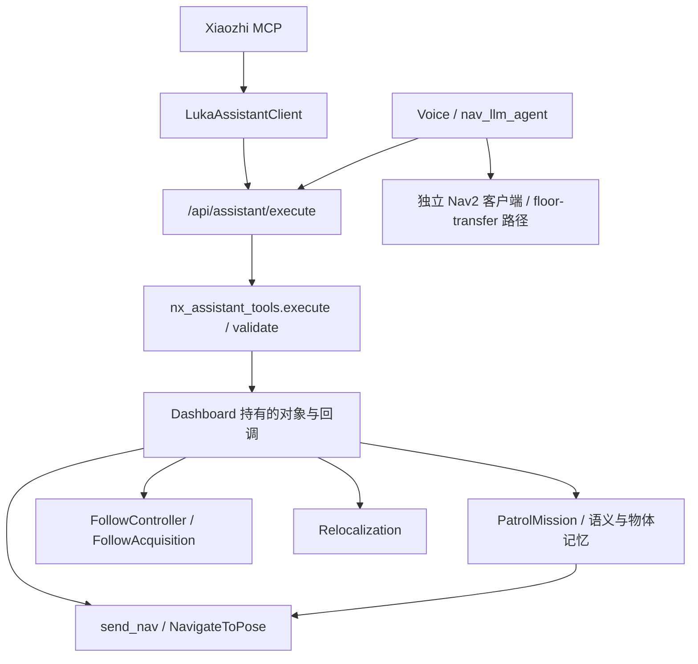
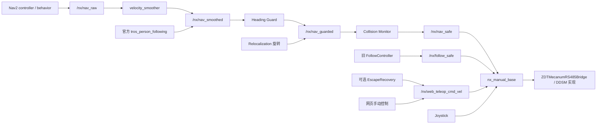

# 当前源码依赖图

初始基线：`17a60d4bf9c0ae367342339df198b44166d5a258`。本次为本地源码审计，尚未读取 S100 服务或 ROS 图。开始时计划列出的 22 个文件/目录均存在，Git 检出干净，分支为 `main`。修改前创建本地标签 `pre-luka-architecture-surgery-20261007-181253`。

首次 push 被远端并发更新拒绝：`main` 前进到 `877992f`，变更为根目录快捷链接移除与 canonical 配置/地图/状态/启动路径迁移（107 个文件）。读取其 diff 后，将本轮提交 rebase 到该基线，保留全部上游变更并重跑测试。下图的调用和运动 topic 没有随该路径迁移改变；当前路径描述以 `877992f` 为准。

## 交互与执行

可检索证据：

| 依赖 | 文件与符号 |
|---|---|
| MCP 只经 HTTP API | `system/xiaozhi/luka_mcp_server.py`、`luka_assistant_client.py::execute` |
| 小智运动默认关闭，停止例外保留 | `luka_assistant_client.py::SAFE_STOP_TOOLS`、`LUKA_XIAOZHI_ALLOW_MOTION` |
| Assistant API 执行与取消 generation | `visualization/console/nx_dashboard.py::do_POST` 的 `/api/assistant/execute` 分支 |
| 工具校验、grounding 与分派仍在 UI 目录 | `visualization/console/nx_assistant_tools.py::validate/execute` |
| Nav2 客户端及行为/任务所有权 | `nx_dashboard.py::init/send_nav/stop_nav` |
| Patrol 通过注入回调导航 | `nx_patrol_mission.py::PatrolMission.__init__(node, send, stop, speak, root)` |
| 巡航/找物范围与会话恢复 | `nx_patrol_mission.py::current_scope/target/recover/verify_observation` |
| 已选择人体的 fail-closed 跟随 | `nx_follow.py::FollowController`、`nx_follow_acquire.py`、`nx_follow_detour.py` |
| agent 双执行入口 | `system/nav_llm_agent/nav_llm_agent/agent_node.py` 的 `nx_assistant_tools` import、HTTP 调用、`_nav_client`、`_send_navigation_pose` |

`CapabilityRegistry` 目前加载 schema/handler/workflow 元数据，`WorkflowEngine` 保存流程状态；它们尚未统一到独立 Capability Gateway。Dashboard 通过 monkey-patch 为 `lightweight_robot_dashboard.DashboardNode` 安装方法，基础 UI 模块也有 legacy destination 接口；现有 API 不能直接删除。

## 源码中的运动路径

官方 Follow 的选人桥、YOLO26 Seg/RGB-D depth、selected-person 策略和自动/demo MOT 模式见 `control/luka_person_following/launch/selected_follow.launch.py` 与 `target_gate.py`。官方 Follow 可以提交 Nav2 action 或直接速度；launch 默认 `dry_run=true`，直接真实速度指向 `/nx/nav_smoothed`。

## 与原计划需要对齐的差异

1. **旧 Follow 未走同一条安全链。** `nx_follow.py` 发布 `/nx/follow_safe`，Base 直接订阅；它有自己的范围、目标、scan 和障碍检查，但不能宣称经过 Heading Guard / Collision Monitor。
2. **Recovery 已经存在。** `nx_escape_recovery.py` 的自主脱困借用网页手动 topic，默认 `NX_SAFE_ESCAPE=0`，仅软件模式实例化。这是 Phase 7 的额外自主源，不能当作普通人工遥控而遗漏。
3. **驱动调用已有三个例外。** `nx_manual_base.py` 继承 driver；`nx_manual_stop.py` 直接发电机停止；`nx_readonly_odom.py` 直接读取编码器。护栏冻结具体模块导入，禁止新增例外；现有两个调试工具不得在测试时 import。
4. **驱动包也含上层职责。** `control/ddsm_car_control` 中还有 auto_localizer、patrol_manager、final_approach、elevator 等模块和独立 topic 默认值；目录名称不能证明只有电机协议。当前主启动配置未证明启动了这些工具，不能全部当成现场活跃源，也不能删去其兼容能力。
5. **纯 suite 并非原本全部通过。** 收集错误和本轮仅测试修复见 [README](README.md)。Phase 0 不通过修改产品源码来掩盖这两个问题。
6. **上游已移除根目录兼容入口。** `877992f` 的 service 和 launcher 改为 `system/bringup/start_*.sh`；Dashboard 仍通过 `system/runtime/tools/nx_dashboard.py` 运行，目录链接目标是 `visualization/console`。配置、地图与状态分别使用 `common/config`、`map/maps`、`common/state`，agent 的 restart script 也使用 canonical 路径。本轮没有恢复已移除的根链接，保留 `src/` 与 `system/runtime` 的 Git `120000` 类型，没有以 Windows 启动验证替代真机验证。

这些差异已纳入文档和静态清单；本轮没有纠正或切换运行行为。未来 Phase 7 要覆盖 Nav2、官方 direct Follow、旧 Follow、Relocalization 和 Recovery；人工网页/joystick 保留独立接管语义。
