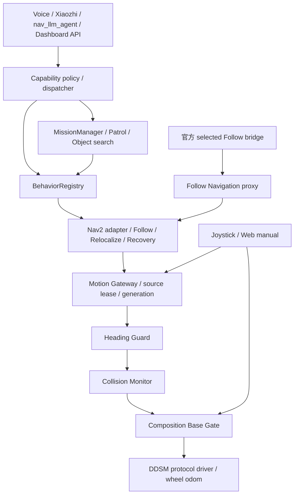

# 当前实现架构

迁移前的依赖与差异保存在 [BASELINE_RUNTIME_ARCHITECTURE.md](BASELINE_RUNTIME_ARCHITECTURE.md)。当前实现位于 Git main，现场验收范围见 [REFACTOR_ACCEPTANCE.md](REFACTOR_ACCEPTANCE.md)。

| 职责 | canonical 实现 | 保留的兼容入口 |
|---|---|---|
| 工具目录、grounding、policy、dispatch | system/luka_capabilities | nx_assistant_tools；HTTP API 路径 |
| 导航与跟随、重定位、短时脱困 | behavior/luka_behaviors | nx_follow / nx_follow_acquire / nx_follow_detour / nx_relocalization / nx_escape_recovery |
| 巡航、找物、语义会话与重启恢复 | mission/luka_mission | nx_patrol_mission 模块 alias |
| 自主源许可与超时停止 | control/luka_motion_gateway | 标准 ROS 消息与既有行为接口 |
| 最终门控与人工接管 | control/luka_base_gate | nx_manual_base 命令 wrapper；原服务名 |
| 总启动和兼容导航启动 | system/luka_bringup | system/bringup/start_nx_*.sh、nx_navigation.launch.py |

自主输入为 /luka/motion/nav、follow、relocalize、recovery；输出 /luka/motion/autonomy 再经过 /nx/nav_guarded、/nx/nav_safe 到 Base Gate。旧直接 Follow 安全出口订阅已移除。官方 Follow 的 action 可显式切换到 Nav2 source，完成后交回 follow source；未重写官方 C++ 控制算法。

Gateway 使用 owner、boot、generation 和 0.6 s lease，命令 watchdog 为 0.25 s。停止、人工接管、底盘状态过期和网关重启撤销授权，取消旧行为。取消路径在 ROS 回调内不阻塞等待同组服务响应。目标参数继续经过原地图、身份、深度、时间戳、安全及最终驱动门。

BehaviorRegistry 和 MissionManager 共用一个运行宿主及 ROS node；Dashboard 提供 UI/API，核心执行代码已迁出。旧 agent metadata / WorkflowEngine 仍保留，但旧动作回调必须委托 Gateway；未实现的电梯等能力继续明确不可用，不能把旧 placeholder 当可执行授权。

源文件检查不能证明现场没有第二个发布者或旧服务；最终启动时须核对 node、topic、service 和进程。机器人原有未提交修改保存在原工作树与回退归档；本轮构建、ROS 集成和架空轮使用独立候选目录，生产目录没有被覆盖。落地验收按用户最新要求暂缓。
