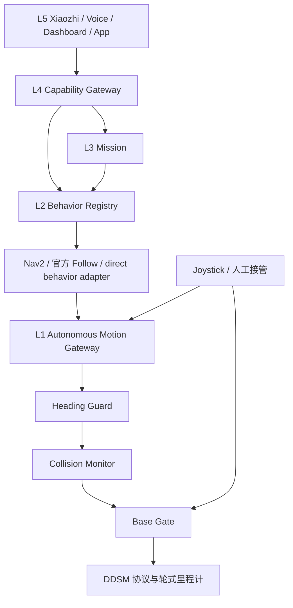

# 目标架构和迁移门槛

## 分批实施

| 阶段 | 范围 | 完成门槛 |
|---|---|---|
| Phase 0（本轮） | 文档、跳层检查、当前源清单 | 既有 suite 与 architecture 全部通过；运行源码不变 |
| Phase 1–2 | 纯 capability policy、dispatcher、旧入口 wrapper | 旧/新 API 一致、Xiaozhi grounding/停止门仍有效 |
| Phase 3–4 | Behavior adapter、Mission 实现迁移与 shim | Follow fail-closed、任务/会话/重启恢复专项测试通过 |
| Phase 5–6 | agent 入口收敛、Dashboard 依赖逆转 | 无新动作实现落入 Interaction；保留全部 HTTP API |
| Phase 7 | 全部自主速度源、显式租约、超时归零、epoch、接管 | 静态/模拟测试后单独 S100 验收；不能只改官方 Follow |
| Phase 8 | Base Gate 与 driver 组合解耦 | 独立于 Phase 7；另一次 S100 验收后才考虑分节点 |
| Phase 9–11 | canonical bringup、历史分类、CI 约束 | 保留 wrapper；colcon 验证前保持 src 兼容体系 |

Motion Gateway 的目标输入为 `/luka/motion/nav`、`follow`、`relocalize`、`recovery`，唯一自主输出 `/luka/motion/autonomy`。旧 Follow direct source 也必须进入 `follow` 的单一租约或明确停用旧运动实现；不得同时授权两个 follow 发布者。人工遥控仍是人工源，接管时撤销自主租约并取消行为。

上游 `877992f` 已移除根目录快捷链接并迁移 canonical 路径。后续兼容策略应保留当前 `system/bringup`、`system/runtime` 和外部 API，不机械恢复已由上游移除的根链接；Phase 9/10 须以这次路径迁移为基准继续盘点。

## 产品约束

酒店语义地图、spatial/object memory、地图作用域校验、观察点、身份不确定性、多命中选择、last_seen、verification/semantic 会话和 generation 取消保留。`track_id` 仍是临时轨迹号，不替代身份确认。不启用 CPU OSNet，不用官方 MOT 接管产品身份权威，不修改 YOLO26 Seg / RGB-D depth 的安全语义。

Mission 调用 Behavior；Behavior 包装 Nav2/官方 Follow/重定位；Capability 只负责 schema、grounding、policy 和 dispatch。Dashboard 保持 UI/API host。所有自主运动经 Gateway / Safety / Base Gate；driver 只负责协议、运动学、编码器和轮式里程计。

## 验收边界

本轮没有 ROS build、录制回放或真机验收。未来构建须记录失败包和依赖；静态通过不能写成 ROS 或硬件 PASS。真机测试先保持 `LUKA_XIAOZHI_ALLOW_MOTION=0`，按只读、架空轮、受控低速、Follow、Nav2、重定位、人工接管、传感器过期、小智动作最后的顺序进行。
