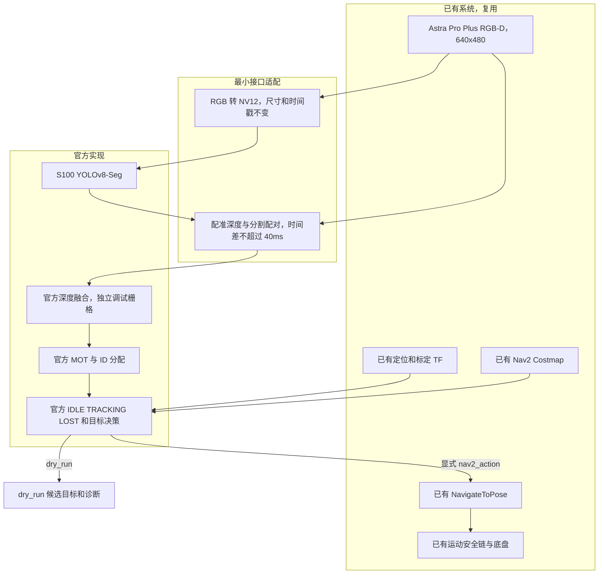

# 实际架构

新 Launch 不启动相机、StereoNet、SLAM、定位、TF、Costmap、Planner、Controller、底盘、WebSocket 或 Foxglove。
启动前通过新建 ROS 图查询器检查需要创建的发布者和跟随节点，避免重复实例。

官方动态选人、运动条件、距离带、迟滞、死区、限频、空闲栅格、预测和 MOT 重锁保留。
原 IDLE 搜索改为静止观察，edge-turn 禁用；LOST 保留预测/导航到观察点，到达后等待重锁或超时。
不执行方向旋转扫描，不伪造旋转完成。该限制与完整上游旋转搜索能力有区别。

核心不创建任何 Twist publisher。dry_run 在原 Action 发送决策点输出候选，不发送或取消任何 Action。
nav2_action 只发送 NavigateToPose，按自身 handle/UUID 取消；generation 过滤迟到反馈/结果，关闭跟随后迟到接受的目标按自身 UUID 取消。
独立可执行文件在 SIGINT/SIGTERM 时保留 ROS 客户端 3 秒，处理迟到响应与取消；组件插件仍保留，但完整优雅关闭测试使用独立入口。
SIGKILL 或响应超过关闭等待时间无法保证取消，须由已有运动安全链和操作员处理。

MOT 的 track_id 是临时轨迹编号，不具备 ReID 永久身份保证。本链路不调用旧 HTTP 选人、ReID、EdgeTAM 或额外运动控制器。
