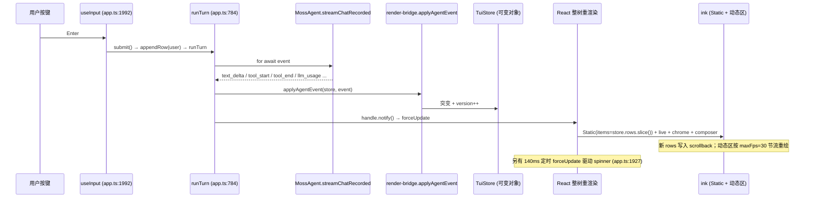
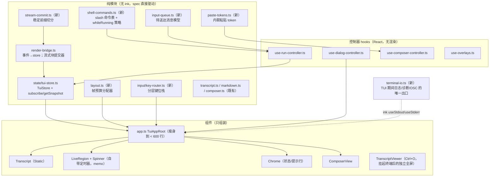

# Moss TUI「Claude Code 体感」改造：规划与实施方案

> 日期：2026-10-08。作者：规划会话（只读调研 + 真实 PTY 实测，未改任何 `src/`）。
> 读者：负责实施的模型 / 工程师。本文自包含：现状、证据、目标、分阶段任务、验收、交接纪律。
> 代码行号基于 main `58e7f614`（v0.25.0 后 3 个收尾 commit）。**注意**：撰写时另一会话正在同一
> 工作区实施 v0.26 权限模型（已改 `src/cli/tui/app.ts`、`transcript.ts`、`copy.ts`、`app-helpers.ts`、
> `interaction-mode.ts`、`approval.ts`、`config.ts`），行号可能有小幅漂移，以符号名为准。

---

## 0. 一句话目标与「无卡点」的可测定义

**目标**：在不改变 v0.22 已对齐的「形态」（单列 transcript 进终端 scrollback + 底部 composer + `❯ ⏺ ⎿ ✻`
标记语法 + 内联审批）的前提下，把 moss TUI 的**交互体感**做到 Claude Code（下称 CC）水平：用户在任何
时刻都能看、能打字、能提交、能打断、能回看，界面不闪、不错位、不吞字、不重复、不卡住。

v0.22 的对标工作解决的是**长什么样**（见 `docs/cli-parity/`，D-1…D-15 已关）；本方案解决的是
**用起来顺不顺**，这是之前没有覆盖的维度。

「卡点」必须可测，否则无法验收。本方案把它定义为下列 SLO（全部可用 §8 的工具自动测量）：

| #   | SLO                                                      | 当前实测（v0.25 HEAD）                                    | 目标                        |
| --- | -------------------------------------------------------- | --------------------------------------------------------- | --------------------------- |
| S1  | 按键 → 屏幕回显延迟（空闲 / 流式 / 工具风暴）            | p50 ≈ 7ms，偶发 75ms                                      | p95 ≤ 33ms，max ≤ 100ms     |
| S2  | 任意场景、任意 ≥ 80×10 终端，整屏清除（`ESC[2J`）次数    | **90×14 工具风暴：8 秒内 372 次**                         | 0（resize 除外）            |
| S3  | 动态区（live + chrome + composer）高度                   | 无预算，可超过终端行数                                    | 恒 ≤ rows − 1               |
| S4  | TUI 运行期间绕过 ink 直写 stdout/stderr 的字节数         | 默认 `warn` 日志直写 stderr → **幽灵帧**                  | 0                           |
| S5  | 长回答流式时，已完成的 markdown 块进入 scrollback 的延迟 | **整轮结束前不进入**；live 区只显示尾部 8 行              | 块完成后 ≤ 100ms            |
| S6  | 运行中提交消息：回显次数 / 顺序                          | **回显 2 次**，且第一次插在正在流式的回答之前             | 恰好 1 次，下一轮发出时落位 |
| S7  | 审批框弹出后误触：弹出瞬间正在打字的字母被当作审批答复   | `y/a/n` 裸字母即答复（`a` = 本会话总是允许）              | 弹出后 350ms 内按键不答复   |
| S8  | Ctrl+O 对 scrollback 的写入                              | 重新输出整个 transcript（scrollback 内容翻倍）            | 0（独立全屏查看器）         |
| S9  | 首次 `@` 打开菜单耗时（5 万文件仓库）                    | 同步遍历，阻塞事件循环（未量化，代码证据）                | ≤ 50ms，不阻塞输入          |
| S10 | 粘贴后 composer 中已有草稿                               | **被占位文本整体替换，草稿丢失**                          | 草稿保留，粘贴为内联 token  |
| S11 | 运行中可用的 `/` 命令                                    | 运行中 palette 完全关闭；`/model` `/compact` `/task` 拒绝 | 只读命令即时执行，其余排队  |
| S12 | 启动到可输入                                             | 0.64–1.0s                                                 | ≤ 1.0s，且启动期按键不丢    |

---

## 1. 现状全景（实施者必须先读懂的部分）

### 1.1 入口与依赖边界

- `src/cli-main.ts:1054-1105`：TTY 且 `MOSS_NO_TUI!=1` 且非 `--print` 时动态 `import('./cli/tui/app.js')`，
  否则走 readline REPL（`src/cli/repl.ts`，永久保留）。
- ink/react 只允许在 `src/cli/tui/` 静态导入（`app.ts` 头注释 + ESLint `moss/boundary-*`）。
- 依赖：`ink@7.1.1`、`react@19.3`、测试用 `ink-testing-library@4`。**ink 7 自带但 moss 未使用的能力**：
  `incrementalRendering`、`kittyKeyboard`、`usePaste`、`useCursor`、`useApp().suspendTerminal`、
  `maxFps`（默认 30）、`concurrent`。

### 1.2 `src/cli/tui/` 文件职责

| 文件                                               | 行数 | 职责                                                                                                           |
| -------------------------------------------------- | ---- | -------------------------------------------------------------------------------------------------------------- |
| `app.ts`                                           | 2946 | **单体组件** `TuiAppRoot`：全部状态（~40 个 useState/useRef）、一个 580 行的 `useInput`、所有 slash 路由、渲染 |
| `app-helpers.ts`                                   | 530  | 选项类型、纯函数（审批视图解析、palette 窗口、会话选择器…）                                                    |
| `render-bridge.ts`                                 | 474  | `MossAgentEvent` → `TuiStore`（rows / run / usage / todos）；纯函数                                            |
| `transcript.ts`                                    | 1101 | 投影：row → `TuiLine[]`、live 区、审批框、状态行、提示行；纯函数                                               |
| `composer.ts`                                      | 427  | 多行编辑器模型 + 软换行投影（按 grapheme / 单元格宽度）                                                        |
| `markdown.ts`                                      | 479  | markdown → `TuiLine[]`（含 `renderStreamingMarkdown` 稳定前缀算法）                                            |
| `input-box.ts`                                     | 60   | 自研 bracketed-paste 捕获                                                                                      |
| `palette.ts` / `mentions.ts` / `history-search.ts` | —    | `/` 菜单、`@` 菜单、Ctrl+R                                                                                     |
| `copy.ts`                                          | 385  | zh 文案字典，`tui(english, params)` 查表（英文原文为 key）                                                     |
| `help.ts`                                          | 110  | 键位表 + 命令表（命令表派生自 `src/cli/interactive-commands.ts`）                                              |
| `text.ts` / `code-style.ts` / `tool-summary.ts`    | —    | 单元格宽度、代码高亮、工具完成摘要                                                                             |

### 1.3 数据流（一次用户回合）



关键事实：

1. **Store 是可变对象 + 手动 notify**，整个 `TuiAppRoot` 每次事件都重渲染（含 palette 过滤、mention 过滤、
   live 区 markdown 投影）。当前规模下 CPU 不是瓶颈（实测按键延迟 p50 7ms），但它让任何局部优化都无从下手。
2. **流式文本只保留 400 字符尾巴**（`render-bridge.ts:174-176, 186-189`），live 区只画最后 8 行
   （`transcript.ts:697`）；整段回答要到 `done` 才用 `event.result.response` 一次性提交
   （`app.ts:837-852`，N-4 修复）。`tool_start` / `retry` 时会把已有 prose 冲成一行（D-6，`app.ts:808-834`）。
3. **Static 一旦提交永不重绘**。Ctrl+O 与 `/clear` 都靠改 `key` 重挂 `<Static>`（`app.ts:2900-2909`），
   即**把整个 transcript 再输出一遍**。
4. **ink 的整屏重绘路径**（`node_modules/ink/build/ink.js:89-112, 750-775`）：只要动态区高度 > 终端行数
   （或从 ≥rows 缩回），ink 就 `clearTerminal + fullStaticOutput + frame`——**把整个会话历史重放一遍**，
   且 `fullStaticOutput` 只增不减。长会话里这是灾难级卡顿与闪屏的来源。
5. 输入：一个巨型 `useInput`（`app.ts:1992-2575`）按 if 顺序处理 dialog → 会话选择器 → Ctrl+R →
   mention → help → model picker → palette → 编辑键。粘贴由**另一个** `stdin.on('data')` 监听器
   （`app.ts:2577-2600`）并行处理。
6. 审批/提问：`approval.ts` 通过 `setCliApprovalViewAsker` / `setCliApprovalAsker` 把请求交给
   `app.ts:507-569` 的 `PendingDialog` 状态机（exactly-once settle，D-2）。
7. 运行中提交：`submit()` 先 `appendRow(user)` 再入队（`app.ts:1844-1850`），`drainQueue()` 出队时又
   `appendRow(user)`（`app.ts:910-920`）。另有独立的 `/steer`（`moss-agent.ts:361` 的 inbox steer，
   在下一个边界注入为 `[User steering update]`；run 结束仍未消费的 steer 会被 `retireSteeringMessages` 退役）。

### 1.4 已有测试资产

- `test/tui-*.spec.mjs` 17 个文件约 7000 行（ink-testing-library 组件级 + 纯函数级），`cli-tui*.spec.mjs` 3 个。
- `test/tui-perf.spec.mjs` 只测数据结构（10k rows 投影 / 10k delta 摄入），**不测真实帧、字节、清屏、按键延迟**。
- `scripts/smoke-moss-cli.mjs` 有 PTY 启动冒烟（python pty）。
- `scratch/tui-drive.py`（PTY + pyte 驱动）、`scratch/compare-cli.py`（与本机 `claude` 并排对照）、
  `scratch/verify-stub.mjs`（零配额 OpenAI 兼容 stub）。`scratch/` 被 gitignore。
- 本次新增（同在 `scratch/`，未入库）：`scratch/tui-feel-probe/{stub.mjs,probe.py,ghost.py,queue.py}`。

---

## 2. 实测证据（真实 PTY + 零配额 stub）

方法：`scratch/tui-feel-probe/stub.mjs`（`longstream` = 约 4.5k 字符 markdown 以 12 字符/25ms 流出；
`toolstorm` = 20 次连续 `list_directory`）+ `probe.py`（python pty + pyte，测回显延迟、写出字节、
同步帧 `ESC[?2026h` 数、整屏清除 `ESC[2J` 数）。命令见 §8.2。

| 场景                   | 100×30                        | 90×14                               |
| ---------------------- | ----------------------------- | ----------------------------------- |
| 启动到 composer 可见   | 642ms                         | 995ms                               |
| 空闲按键回显           | 7–17ms                        | 6–22ms                              |
| 流式期间按键回显       | 7–16ms，一次 74.8ms           | 6–7ms                               |
| 工具风暴（20 次调用）  | 458KB / 334 帧 / **0 次清屏** | 552KB / 386 帧 / **372 次整屏清除** |
| 有历史后再流式 8s      | 433KB / 338 帧 / 0 次清屏     | 406KB / 337 帧 / 0 次清屏           |
| 300 行粘贴到占位行出现 | 12ms                          | 9ms                                 |

**结论 1：按键处理本身不慢**——问题不在 React/输入延迟，而在**终端输出管理**与**交互语义**。

其余在实测中直接观察到的问题（截屏在 `scratch/tui-feel-probe/shot-*.txt`）：

- **E1 幽灵帧（已定位根因）**：provider 重试时，`✢ Working… 0s`、`● running` 等 live 区帧残留进历史，
  且每条 `↻ provider retry N` 打印两次。同一场景 `MOSS_LOG_LEVEL=warn`（默认）出现、`=error` 消失
  （`ghost.py` 对照）。根因：`src/logger.ts:155-194` 的默认 sink **故意绕开 ink 直写 `process.stderr`**，
  而 TUI 下 stderr 与 stdout 是同一 TTY，ink 的 log-update 行数记账被打乱，`eraseLines` 擦错位置。
  同类直写点还有 `src/core/tools/tool-hooks.ts:112,145,171`、`src/cli/hooks.ts:184-292`、
  `src/core/loop/agent-loop.ts:774`，以及 TUI 自己的 `/clear`（`app.ts:1627`）与 `notifyAttention`（`app.ts:444`）。
- **E2 90×14 全屏清除风暴**：工具风暴时动态区（reasoning 2 + 流式 8 + spinner + 静默提示 + 队列预览 +
  状态 + 两条横线 + composer + 提示行）超过 14 行，ink 每帧走 clear + 重放全部历史。终端只要稍矮
  （分屏、IDE 内嵌终端），或打开 todo 面板 / palette / help / verbose，就会触发。
- **E3 长回答不可读**：流式期间屏幕只有最后约 8 行**原始** markdown（可见 `## Section 28` 字面量），
  开头既不在屏幕也不在 scrollback，用户无法边生成边读；结束时才整体渲染提交。
- **E4 队列消息双回显**：`queue.py` 在流式中提交 `queued follow-up`，transcript 第 16 行与第 25 行各出现
  一次 `❯ queued follow-up`；第一次还插在它并未回应的那段回答之前。
- **E5 跨轮 prose 粘连**：工具风暴截屏出现 `Step 2.Step 3.Done.`——多次模型调用的文本被拼成一行
  （D-6 只在 `tool_start` 冲刷，本例后续轮次没有冲刷点；需用 systematic-debugging 确认是否因
  重复调用被 loop-guard/replay 短路导致没有 `tool_start`）。
- **E6 只读工具刷屏**：20 次只读调用打印 20 个几乎相同的 `⎿ .moss/ · 0ms / … 9 lines · ctrl+o` 块；
  CC 把连续只读调用折叠为一行活动摘要（`claude-code-surface.md` §9：`Read 1 file`、`Ran 1 shell command`）。

代码阅读得到、未单独实测的问题（实施时先补「修复前失败」的测试）：

- **C1 审批误触**：`app.ts:2120` 裸字母 `y/a/n` 直接作答；用户正在输入 "and…" 时审批弹出，`a` 即
  「本会话总是允许」。
- **C2 粘贴吞草稿**：`app.ts:2588` 粘贴完成后 `setInput('[paste: N lines …]')` 覆盖整个 composer；
  Enter 只发送粘贴内容（`app.ts:1834-1842`），粘贴前写的说明文字丢失，也不能在粘贴前后补充文字。
- **C3 运行中命令全关**：`app.ts:1891` 运行中 palette 返回 `[]`；`/model`（1310）、`/compact`（1282）、
  `/task`（1051）直接拒绝并让用户「先按 Esc」。
- **C4 Ctrl+O 翻倍 scrollback**：`app.ts:2516-2521` + `2900-2909` 重挂 Static，整段历史再打印一遍；
  verbose 下 live 区流式全量显示（`transcript.ts:697`），极易触发 E2。
- **C5 `@` 首开阻塞**：`mentions.ts:44-79` 同步 `readdirSync` 递归（上限 6000、深度 8，不读 `.gitignore`），
  在 `useEffect` 中执行（`app.ts:1917-1922`），首个 `@` 在大仓库会冻结输入；索引只建一次，之后新建的文件搜不到。
- **C6 提示历史不持久**：`app.ts:353` `useState<string[]>([])`，重启后 ↑ 为空（CC 按项目持久化）。
- **C7 Shift+Enter 依赖终端**：未启用 kitty keyboard 协议，多数终端 Shift+Enter 与 Enter 不可区分，
  只能靠 Ctrl+J / 行尾 `\`。
- **C8 整树重渲染 + 140ms spinner 定时器**：`app.ts:1927-1931` 每 140ms forceUpdate 整个应用。
- **C9 中断后队列**：Esc 中断后队列继续 `drainQueue`，用户刚想纠正就自动发出下一条（`runTurn(...).then(drainQueue)`）。

---

## 3. 与 Claude Code 的体感差距清单

「CC 行为」一栏：标 ✅ 的已在本机 CC 2.1.285 PTY 实录（`docs/cli-parity/claude-code-surface.md` 章节号）；
标 ⚠ 的来自 CC 公开行为但**本仓库未实录**，实施对应任务前必须用 `scratch/compare-cli.py` 对本机
`claude` 复核一次，以实测为准。

| 场景                   | CC 行为                                                                                  | moss 现状         | 等级 |
| ---------------------- | ---------------------------------------------------------------------------------------- | ----------------- | ---- |
| 长回答流式             | ⚠ 按块渐进提交到 scrollback，可边生成边读                                                | E3                | P0   |
| 终端矮 / 面板多        | ⚠ 不清屏重放                                                                             | E2                | P0   |
| 内部日志               | 不污染画面                                                                               | E1                | P0   |
| 运行中打字并回车       | 已拍板：排到下一轮，显示在 spinner 下方；Esc 取消当前轮；↑ 可取回编辑                    | E4 双回显         | P0   |
| 审批框                 | ✅ §6 数字 + Enter + Esc；Tab amend                                                      | C1 裸字母即答     | P0   |
| 粘贴                   | ⚠ `[Pasted text #1 +N lines]` 内联占位，前后可继续输入                                   | C2                | P1   |
| 只读工具调用           | ✅ §9 折叠为一行活动摘要；写操作保留完整块                                               | E6                | P1   |
| Ctrl+O                 | ✅ §9 切换「详细 transcript」视图，页脚 `Showing detailed transcript · ctrl+o to toggle` | C4                | P1   |
| Esc Esc（空 composer） | ✅ §12 打开 Rewind 面板，选择回退点                                                      | 仅 `/rewind` 列表 | P1   |
| 运行中 `/` 命令        | ⚠ 菜单可用                                                                               | C3                | P1   |
| Ctrl+G                 | ⚠ 用 `$EDITOR` 编辑当前 prompt                                                           | 无                | P1   |
| `@` 菜单               | ✅ §4 即时打开                                                                           | C5                | P1   |
| 提示历史               | ⚠ 按项目持久                                                                             | C6                | P1   |
| Shift+Enter            | ✅ §2 实测多种换行键；⚠ `/terminal-setup` 引导                                           | C7                | P2   |
| 启动期按键             | ⚠ 不丢                                                                                   | 未处理            | P2   |
| 中断后的队列           | ⚠ 未送达消息回到 composer，不自动发出                                                    | C9                | P1   |

**明确不做**（保持 moss 身份或已有决策，见 `docs/cli-parity/target-spec.md` §Z）：全屏 alternate-screen
主界面（主界面必须留在 primary screen 以保 scrollback / 复制）；侧栏；改动 v0.22 的标记语法；
复刻 CC 的品牌文案。

---

## 4. 设计原则与不变量（实施期间不得破坏）

1. **形态不变**：单列、Static 进 scrollback、底部 composer、`❯ ⏺ ⎿ ✻` 语法、内联审批（N1/N2 冻结接口：
   `src/cli/approval-view.ts` 的审批 payload 与 `transcript.ts` 的 `renderApproval` 选项来源不变）。
2. **终端输出唯一出口**：TUI 存活期间，所有对 TTY 的写入只能经由 ink（Static、动态区、`useStdout().write`、
   `useStderr().write`）。任何模块直写 `process.stdout/stderr` 都是 bug（S4）。
3. **帧预算不变量**：动态区高度恒 ≤ `rows − 1`（S3）。所有可变高度的部件（审批、overlay、todo、live、
   队列预览、composer）必须从统一的预算分配器领取行数。
4. **已提交即事实**：进入 Static 的内容不再修改；需要「另一种视图」时用独立查看器，不重挂 Static。
5. **键不误伤**：任何新弹出的模态，在 350ms 内不把按键当作答复；危险答复（总是允许）只能显式选中。
6. **不丢用户输入**：草稿、粘贴、排队消息、中断时未送达的消息，任何路径都不能静默丢弃。
7. **纯函数优先**：新逻辑放在无 ink 依赖的纯模块里（同现有 render-bridge / transcript / composer 模式），
   组件只做组装，便于 spec 直接驱动。
8. **SDK 公共面不动**：`src/index.ts` 导出面受 `test/sdk-contract.spec.mjs` 快照保护；本方案的所有任务
   都只在 TUI 层实现，不需要改 core 事件面。
9. **本地化**：新增的 moss 自有文案一律走 `tui('<English>', params)` 并在 `copy.ts` 的 `ZH` 字典补 zh；
   `test/tui-locale.spec.mjs` 会检查字典不变量。
10. **REPL 回退永久保留**：所有改动不得影响 `MOSS_NO_TUI=1` / 非 TTY 路径。
11. **子进程纪律**：外部编辑器、`git ls-files` 等一律经 `src/utils/run-process.ts`。

---

## 5. 目标架构



---

## 6. 分阶段实施

阶段顺序按「风险最低、收益最大、为后续铺路」排列。**每个任务一个（或几个）独立 commit**，每个 commit 后
`npm run test:filter -- --filter tui` 必须绿；阶段结束跑 `npm run verify` + §8 的 PTY 探针。
每个任务都给出：目标 / 改动 / 做法 / 验收。修 bug 的任务必须先写「修复前失败」的 spec（AGENTS.md）。

### Phase 0 — 测量护栏（先做，0.5 天）

**T0.1 把体感探针入库为可重复基准**

- 改动：新建 `scripts/tui-feel/stub.mjs`（由 `scratch/tui-feel-probe/stub.mjs` 演化；注意 Node 中流式
  定时器要监听 `res.on('close')`，`req` 的 `close` 在请求体读完即触发——本次踩过）、
  `scripts/tui-feel/probe.py`（pyte + pty，沿用 `scripts/smoke-moss-cli.mjs` 对 python3/pyte 缺失时跳过的做法）、
  `scripts/tui-feel/run.mjs`（拉起 stub → 跑多个尺寸 → 输出 JSON 到 `bench/results/tui-feel-<ts>.json`，不入库）。
  `package.json` 加 `"bench:tui-feel": "npm run build && node scripts/tui-feel/run.mjs"`；AGENTS.md 命令表补一行。
- 场景（全部零配额）：`idle-typing`、`longstream`、`toolstorm`、`stream-after-history`、`ctrl-o`、
  `paste-300`、`queue-while-running`、`approval-popup-while-typing`、`ghost-on-retry`（stub 停机）、
  `resize-shrink`。尺寸：100×30、90×14、80×10、160×50。
- 指标：S1–S12 中可自动测的全部字段；pyte 用 `HistoryScreen` 以便检查 scrollback 内容（S5、S6、S8）。
- 验收：在当前 HEAD 跑出与 §2 同量级的基线 JSON，并把基线数字写进本文 §9 的进度表。

**T0.2 进程内帧预算 spec（CI 可跑，不依赖 python）**

- 改动：新建 `test/tui-frame-budget.spec.mjs`。用 ink `render()`（不是 ink-testing-library，因为后者的
  stdout 非 TTY、不会走整屏清除分支）+ 自制 `Writable`（`isTTY = true`、`columns`、`rows`、可触发
  `resize`）+ `interactive: true`，挂载 `TuiAppRoot` 与 mock agent。统计写入中的 `\x1b[2J` 次数与每帧
  动态区高度。
- 初始状态：对 90×14 + 工具风暴 mock 断言 `clears === 0` —— **此 spec 在 Phase 1 前应为红**，先以
  `skip` 标记入库并注明「Phase 1 T1.2 转绿」，避免 CI 红线。（或者在 T1.2 同一 commit 里先红后绿。）

### Phase 1 — 输出通道与帧预算（P0，1–2 天，收益最大、改动最小）

**T1.1 TUI 期间的唯一输出出口（修 E1 幽灵帧）**

- 改动：
  - `src/logger.ts`：增加可注入 sink 的端口，例如 `setRootLogSink(sink | null)`（保持默认行为不变；
    logger 处于内层，新增端口是合法扩展，注意 ESLint 边界）。
  - 新建 `src/cli/tui/terminal-io.ts`：TUI 挂载时安装 sink——`warn/error` 级日志**不写终端**，而是
    (a) 追加到 `<runtimeDir>/logs/tui-<sessionKey>.log`；(b) `error` 级与「用户需要知道」的 `warn`
    （去重、限频，每类每分钟最多 1 条）以 `system` 行进入 transcript（文案走 `tui()`）。卸载时恢复。
  - `src/core/tools/tool-hooks.ts`、`src/cli/hooks.ts`、`src/core/loop/agent-loop.ts:774` 的
    `process.stderr.write` 改为走 logger（或一个 `src/utils/diagnostic.ts` 的 `writeDiagnostic()`，
    默认仍写 stderr，TUI 期间被同一 sink 接管）。grep 全仓 `process.stderr.write|process.stdout.write`，
    逐个判断是否可能在 TUI 存活期间执行。
  - `app.ts` 的 `/clear`（1627）与 `notifyAttention`（444）改用 `useStdout().write`（ink 的
    `writeToStdout` 会先擦帧再恢复，不会打乱记账）。`/clear` 是否需要清 scrollback（`\x1b[3J`）
    参照 CC 实测（§12 只说保留 banner），保持现语义即可。
- 验收：
  - 新 spec：TUI 挂载后 `logger.warn(...)`，断言假 stderr 收到 0 字节、日志文件有内容、帧完整。
  - PTY：`ghost-on-retry` 场景在默认 `MOSS_LOG_LEVEL` 下屏幕上**不出现**残留 spinner 行，
    每条 `↻ provider retry N` 恰好一次（对照 §2 E1 截屏）。

**T1.2 帧预算分配器（修 E2，建立 S3 不变量）**

- 改动：新建 `src/cli/tui/layout.ts`（纯函数）：

  ```ts
  export interface ChromeSection {
    id: 'dialog' | 'overlay' | 'todo' | 'status-notes' | 'queue' | 'live';
    lines: TuiLine[];
    min: number; // 至少保留的行数（审批的问题行、spinner 行）
    priority: number; // 越小越先满足
    trim: 'head' | 'tail'; // 超预算时裁掉哪一端（live 保留尾部，overlay 保留选中窗口）
  }
  export function allocateFrame(
    rows: number,
    fixed: number,
    sections: ChromeSection[]
  ): TuiLine[][];
  ```

  - 固定成本 `fixed` = 状态行 + 两条横线 + composer 实际行数 + 提示行。可分配 = `rows − 1 − fixed`。
  - 分配顺序：dialog（复用 `renderApproval` 的 `maxHeight` 降级逻辑）> overlay（palette/mention/
    history/session/model/help——同一时刻只会有一个，取其窗口）> status-notes（statusLine、context 警告、
    blocked 任务行）> todo > queue 预览 > live（reasoning、流式尾、spinner、静默提示）。
  - 极小终端：composer 也要可缩（`COMPOSER_MAX_ROWS` 改为 `min(6, max(1, rows − 6))`）。
  - `app.ts` 渲染段（2604-2928）改为：先生成各段 `TuiLine[]`，再交给 `allocateFrame`，最后渲染。
  - verbose（Ctrl+O）下 live 区不再全量显示流式文本——全量查看归 T5.1 的查看器。

- 验收：
  - `test/tui-layout.spec.mjs`：性质测试——rows ∈ [6, 60] × 各状态组合（审批 + todo + palette + 流式 +
    队列 + 状态提示），断言总高度 ≤ rows − 1、审批问题行永远在、spinner 行在 live 存在时永远在。
  - T0.2 的帧预算 spec 转绿；PTY `toolstorm@90×14` 与 `@80×10`：`full_clears == 0`。

**T1.3 渲染选项评估：`incrementalRendering` / `maxFps`**

- 改动：`runTuiApp`（`app.ts:2942`）的 `render()` 选项增加 `incrementalRendering: true`（env
  `MOSS_TUI_INCREMENTAL=0` 可关），`maxFps` 保持 30 或调到 60 视测量。
- 做法：用 T0.1 基准对比开/关的 `bytes`、`frames`、S1；在 iTerm2、Terminal.app、VS Code 内置终端、
  Ghostty（若有）各人工观察一次闪烁与残影（pyte 无法覆盖真实终端差异）。
- 验收：字节数显著下降（预期 ≥ 40%）且无新残影 → 默认开；否则保持关并在本文记录原因。

### Phase 2 — 结构拆分（无行为变化，2–3 天）

> 目的：把 2946 行单体拆成可独立演进的单元，后续 Phase 3–5 才能并行、低冲突地实施。
> 规则：**纯搬移 + 接线**，不改行为；`app.ts` 保留现有 re-export，`dist/cli/tui/app.js` 导入路径不变
> （spec 依赖它）；每抽一块一个 commit，tui spec 全绿。新子目录（`state/`、`input/`、`controllers/`、
> `components/`）仍属 `src/cli/tui/`，先确认 `eslint.config.mjs` 的 boundary 规则对子目录生效方式。

**T2.1 Store 订阅化**：`state/tui-store.ts` 包装现有 `createTuiStore`，提供 `subscribe/getSnapshot`
（snapshot 用 `version` 作为浅身份），组件用 `useSyncExternalStore`；删除 `forceUpdate + handle.notify`
的手动重渲染约定（保留 `notify()` 作为兼容 API 供 controller 调用）。

**T2.2 键位路由**：`input/key-router.ts`——把 `useInput` 的 if 链改为**分层处理器栈**：

```ts
type KeyResult = 'handled' | 'pass';
interface KeyLayer {
  id: string;
  active(): boolean;
  handle(chunk: string, key: Key): KeyResult;
}
// 顺序：global(Ctrl+C/Ctrl+D/Shift+Tab) > dialog > sessionPicker > historySearch > mention
//      > help > modelPicker > palette > composer
```

每层是纯函数工厂（入参是状态快照与动作回调），可在 spec 里用合成按键驱动。迁移时逐层对照原
`app.ts:1992-2575` 的分支，**保留所有既有注释里记录的边界条件**（如 `key.shift` 不能用于过滤大写字母、
批量 `!cmd\r`、`\\` 续行等）。

**T2.3 控制器 hooks**：`controllers/use-dialog-controller.ts`（`PendingDialog` 状态机 + asker 安装，
`app.ts:451-569`、plan gate 1148-1197）、`use-run-controller.ts`（`runTurn`、队列、abort、
`runTaskShellCommand`、verdict 行，784-1146）、`use-composer-controller.ts`（composer、history、stash、
kill ring、paste、Esc 双击，300-395 + 1966-1990）。

**T2.4 Slash 命令表化**：`shell-commands.ts`——把 `submit()` 中 1568-1833 的 if 链和
`runShellCommand` 统一为表：

```ts
interface ShellCommandSpec {
  name: string; // '/usage'
  match?: (text: string) => boolean;
  whileRunning: 'immediate' | 'queue' | 'refuse'; // Phase 4 T4.3 用
  run: (args: string, ctx: ShellCommandContext) => Promise<void> | void;
}
```

注册表（`src/cli/commands/registry.ts`）仍是第一跳，表只承载 shell 本地命令；`help.ts` 的
`SHELL_COMMANDS` 继续作为对外广告源，`test/tui-command-surface.spec.mjs` 必须保持绿。

**T2.5 组件化**：`components/{transcript,live-region,spinner,chrome,composer-view}.ts`
（沿用 `React.createElement`，不引入 JSX 构建链）。`Spinner` 自带 `setInterval`，并 `React.memo`
其余部件，**移除 `app.ts:1927` 的 140ms 整树 forceUpdate**（修 C8）。

- 阶段验收：`app.ts` < 600 行；全部 tui spec 绿；T0.1 基准各指标不劣化（±10% 内）；
  PTY 对照 §2 截屏逐行一致（除 spinner 帧）。

### Phase 3 — 流式渐进提交（P0 体感，2–3 天）

**T3.1 流式块提交器（修 E3，达成 S5）**

- 改动：
  - 新建 `src/cli/tui/stream-commit.ts`（纯函数）：输入「本消息已提交偏移 + 当前完整流式文本」，输出
    「本次可提交的完整块文本 + 新偏移」。复用 `markdown.ts` 中 `renderStreamingMarkdown` 已有的
    **稳定前缀**判定（空行分隔的已闭合块、已闭合 fence），抽成可导出的 `stableMarkdownPrefix(text)`。
  - `render-bridge.ts`：`streamingText` 改为保存**本消息全文**（不再 `tail(400)`；显示层自己截尾），
    新增 `run.committedOffset`；每个 `text_delta` 后调用提交器，有完整块就 `appendRow('assistant', block,
{ continuation: offset > 0 })`。
  - `TranscriptRow` 增加 `continuation?: boolean`：`transcript.ts` 的 assistant 分支在 continuation
    时首行用两空格续行前缀而非 `⏺`，且不额外插空行（保持「一条回答一个 ⏺」的语法）。
  - live 区只显示未提交的尾部（开放块），按 T1.2 预算截尾；开放块仍用 plain 投影避免跳动（保留
    `transcript.ts:683-687` 注释中的理由）。
  - `done` 时：若 `response.startsWith(已提交文本)` → 只提交剩余部分；否则（provider 改写或我们丢了
    delta）提交流式缓冲的剩余部分，不重复已提交内容。这替代 N-4 的「整段 response 覆盖」逻辑，
    但必须保住 N-4 的回归测试（长回答开头不丢）。
  - `retry`：已提交的块无法撤回——保留现有 retry 标记行（`render-bridge.ts:195-211`），
    重试后从新偏移继续；文档化「重试前已提交的部分保留在上方」。
  - 超长开放 fence（单个代码块 > 预算行数）：第一版允许 live 区只显示尾部；第二版（可选）把 fence
    内已完成的行以 code-continuation 行提前提交（同一框线样式）。
- 验收：
  - `test/tui-stream-commit.spec.mjs`：对 `scratch/verify-stub.mjs` 的 `MARKDOWN_ANSWER` 与本次
    `longstream` 文本，以随机切片（固定种子 50 组，1–40 字符）喂入，断言：所有 assistant 行（含 continuation）
    拼接 == 原文（除块间空行规范化）；无重复、无丢失；块在其结束后的下一个 delta 内提交。
  - PTY `longstream@100×30`：流式开始 3s 时 `HistoryScreen` 的 scrollback/屏幕中已出现渲染后的
    `Section 1`（无 `##` 字面量）；结束后 `Section 1` 恰好出现一次。

**T3.2 轮次边界冲刷（修 E5）**

- 先用 systematic-debugging 复现 `Step 2.Step 3.Done.`：在 `toolstorm` 下记录事件序列
  （`.moss/events/<session>.jsonl` 已有），确认后续轮次是否缺 `tool_start`、是否有 `turn_start`。
- 改动：在 `turn_start`（新一次模型调用开始）时同样冲刷未提交 prose（与 D-6 的 `tool_start` 冲刷、
  `retry` 冲刷同一函数）。若根因是被短路的工具调用不发 `tool_start`，在 render-bridge 侧按
  `turn_start` 冲刷即可覆盖，不改 core。
- 验收：spec 构造「text → turn_start → text → turn_start → text」事件序列，断言 3 行独立 assistant 行。

**T3.3 思考（reasoning）呈现**：默认 live 区只显示一行 `∴ Thinking… (Ns)`（CC 风格；当前是最近 2 行
reasoning 文本，仅 `MOSS_SHOW_THINKING=true` 时），全文进 T5.1 查看器。改动小，放在本阶段顺手做；
需保持 `test/cli-tui-noise.spec.mjs` 等现有断言。

### Phase 4 — 输入永不阻塞（P0/P1，3–4 天）

**T4.1 待送达消息模型（修 E4、C9，达成 S6）**

- 改动：新建 `src/cli/tui/input-queue.ts`（纯）：

  ```ts
  interface PendingInput {
    id: string;
    text: string;
  }
  ```

  **已拍板（2026-10-08 产品负责人）：运行中 Enter = 排到下一轮；Esc = 取消当前这一轮；整体与 CC 一致。**
  不使用 `agent.steer` 中途注入（`/steer` 命令保持原样、仅显式调用），因此**不改 core、不改 SDK 事件面**。
  - 运行中 Enter：**不再**立即 `appendRow(user)`；入队并在 live 区 spinner 下方以 dim 行显示
    （`⏵ queued: <预览>`，最多 2 行 + `+N more`，走 T1.2 预算）。
  - 当前一轮正常结束后，按先后顺序把排队消息逐条作为下一轮发出；**发出时**才 `appendRow(user)`
    （回显恰好一次，位置在上一轮回答之后）。删除 `submit()` 中运行时的 `appendRow`，只保留出队时那一处。
  - Esc（或第一次 Ctrl+C）：只取消当前这一轮。未发出的排队消息**退回 composer**（以空行连接，追加到
    现有草稿后），不自动发出（修 C9）；状态行提示 `N queued messages returned to the composer`。
    这一点按 CC 行为实现；实施前用 `compare-cli.py` 对本机 `claude` 复核一次，若 CC 是「中断后继续发送
    队列」则改为与 CC 一致，并在本文记录实测结果。
  - composer 为空且有排队消息时按 ↑：取回最后一条排队消息到 composer 编辑（从队列移除）。
  - `/queue` 子命令（pause/resume/drop/clear）保留，改为操作新模型。

- 验收：
  - 回归 spec（先红）：运行中提交一条消息 → transcript 中该用户行**恰好 1 次**，且位于上一轮回答之后。
  - spec：中断后 composer 含排队文本、队列为空、无新 run 启动。
  - PTY `queue-while-running`：`HistoryScreen` 中 `❯ queued follow-up` 计数 == 1。

**T4.2 审批防误触（修 C1，达成 S7）**

- 改动（`use-dialog-controller` + dialog 键层）：
  - 模态出现后 350ms 内的按键一律吞掉，并在页脚显示一次 `keys paused — dialog just opened`（`tui()`）；
    若这些按键是可打印字符，**追加回 composer 草稿**（不丢用户正在打的字）。
  - **已拍板：移除**裸字母 `y/a/n` 作答（`app.ts:2120`），只保留数字键、↑↓ + Enter、Esc、Tab（amend），与 CC §6 一致。
    数字键 `2`（总是允许）同样受 350ms 保护。帮助与页脚文案同步（`APPROVAL_FOOTER` 来自 N1 payload，
    改 payload 文案属于 N1 冻结接口变更——**先确认** `approval-view.ts` 的 footer 是否提到 y/a/n，
    如提到，在同一 commit 更新并在说明中注明）。
  - question 类对话框同样适用 350ms 保护。
- 验收：spec 用假时钟：弹出后 100ms 内按 `a` → 不作答、composer 草稿末尾多出 `a`；400ms 后按 `1` → 作答。
  PTY `approval-popup-while-typing`：连续键入时弹出审批，审批不被答复。

**T4.3 运行中的 `/` 命令（修 C3）**

- 改动：palette 在运行中照常打开；按 T2.4 的 `whileRunning` 执行：
  - `immediate`：`/help /status /usage /context /mode /permissions /tasks /history /evidence /deployments
/failures /jobs /bg /subs /mcp /skills /hooks /log /diff /queue /steer /stop /clear`；
  - `queue`（作为 `next-turn` 项进入 T4.1 队列，显示为 `⏵ queued: /compact`）：`/compact /model <name>
/task … /review /resume` 及 skill 命令；
  - `refuse` 只留给确实不能排队的（预计没有；若有必须给出可执行的下一步，不是死胡同）。
  - `/model`（无参数）在运行中可以打开选择器，选择结果排队到 run 结束生效，并明说「将在本轮结束后切换」。
- 验收：spec 覆盖每个命令在运行中的行为；`tui-command-surface.spec.mjs` 保持绿。

**T4.4 内联粘贴 token（修 C2，达成 S10）**

- 改动：
  - 用 ink 7 的 `usePaste`（自动开启 bracketed paste，粘贴内容不进 `useInput`）替换 `app.ts:2577-2600`
    的自研 stdin 监听与 `input-box.ts`（保留 `input-box.ts` 的纯函数供旧 spec，或迁移 spec 后删除）。
  - 新建 `paste-tokens.ts`：小粘贴（≤ 2 行且 ≤ 800 字符，阈值可调）直接插入 caret；大粘贴在 caret 处
    插入原子 token `[Pasted text #n · N lines]`，内容存在 composer 侧表 `Map<n, string>`。
  - `composer.ts`：token 作为不可分割单元（光标跳过、Backspace 整体删除、Ctrl+W 视为一个词）；
    提交时按序展开为原文；超大（> 100k 字符）粘贴保留现有「LARGE」警示语义，改写为 token 文案的一部分。
  - 提交到 transcript 的用户行显示 token 形式 + 行数（不把 300 行打进 scrollback），模型收到展开后的全文。
- 验收：spec：先输入「请看日志：」→ 粘贴 300 行 → 输入「哪里报错？」→ Enter，断言模型收到
  `请看日志：\n<300 行>\n哪里报错？`，transcript 行含 token；Backspace 一次删除整个 token。

**T4.5 `@` 索引异步化（修 C5，达成 S9）**

- 改动：`mentions.ts` 增加 `buildWorkspaceIndexAsync(root, { signal })`：优先 `git ls-files -co
--exclude-standard`（经 `runProcess`，尊重 `.gitignore`），非 git 仓库回退到 `fs.promises.opendir`
  分批遍历（每批 200 项 `setImmediate` 让出事件循环）。TUI 启动后空闲时预热；索引超过 30s 且用户再次
  输入 `@` 时后台刷新。索引未就绪时菜单显示一行 `indexing…`，就绪后自动刷新。
- 验收：spec 构造 2 万文件临时目录，断言首个 `@` 键处理耗时 < 50ms（以 `performance.now()` 包住
  key-router 调用）；`.gitignore` 中的目录不出现。

**T4.6 提示历史持久化（修 C6）**

- 改动：`<runtimeDir>/prompt-history.jsonl`（按工作区，上限 500 条，去重保最近；与会话日志同等敏感度，
  不新增外发面）。启动时异步加载，加载完成前 ↑ 使用本会话条目；`!` 命令不入历史（保持现语义）。
  Ctrl+R 搜索同一数据源。
- 验收：spec：两次挂载之间历史保留；损坏行跳过不崩。

**T4.7 键盘协议（修 C7）**

- 改动：`render()` 增加 `kittyKeyboard: { mode: 'auto' }`（ink 自动探测，200ms 超时）；确认 ink 对
  Shift+Enter 报告 `key.return && key.shift`，composer 换行生效。为不支持的终端在 `?` 帮助中说明
  Ctrl+J / `\` 回车；可选新增 `/terminal-setup`（只打印对应终端的配置指引，不改用户文件）。
- 验收：PTY 发送 kitty 序列 `\x1b[13;2u` 时插入换行而不提交；`suspendTerminal` 前后协议正确开关（ink 已处理）。

**T4.8 启动期按键不丢（P2）**

- 改动：`cli-main.ts` 决定进入 TUI 后尽早 `stdin.setRawMode(true)` 并缓存字节，挂载后作为 composer 初值
  注入（注意不要吞掉 Ctrl+C：缓存中出现 `\x03` 时直接退出）。
- 验收：PTY 在 spawn 后 50ms 内键入 `hello`，挂载后 composer 为 `hello`。

### Phase 5 — CC 交互件（P1，3–4 天）

**T5.1 Ctrl+O 详细 transcript 查看器（修 C4，达成 S8）**

- 改动：新建 `components/transcript-viewer.ts` + 纯模块 `viewer-model.ts`（行窗口、滚动、搜索）。
  Ctrl+O 时调用 `useApp().suspendTerminal(async () => { ... })`：在回调中写 `\x1b[?1049h` 进入 alternate
  screen，用独立的小渲染循环（`renderToString` 或直接拼 ANSI）显示 `renderTranscriptRows(rows, width,
verbose=true)` + 当前 run 的流式全文与 reasoning；键位：↑↓/PgUp/PgDn/g/G 滚动，`/` 搜索（可选），
  Esc 或 Ctrl+O 退出 → `\x1b[?1049l`。ink 恢复时只重绘动态帧（已核实 `ink.js` `endSuspend`：
  重置 `lastOutput` 后重绘，不重放 `fullStaticOutput`），主 scrollback 不受影响。
  页脚文案对齐 CC：`Showing detailed transcript · ctrl+o to toggle`。
- 关键风险：挂起期间 ink 丢弃渲染（`onRender` 在 `isSuspended` 时直接 return）。若期间有新 row 进入
  `<Static>`，React 侧已认为提交、终端却没写——**会丢行**。必须在挂起期间冻结 Static 的 items
  （`items = rows.slice(0, frozenCount)`），恢复后放开。spec 必须覆盖「查看器打开期间 run 产出新行」。
- 删除 `verboseRevision` 重挂 Static 的机制；`verbose` 状态与「⋯ ctrl+o」标记的语义改为「打开查看器」。
- 验收：PTY：长会话中 Ctrl+O 前后，主屏 scrollback（`HistoryScreen.history`）字节相同；查看器中能看到
  被折叠的 200 行 `seq` 输出；查看器开启时 stub 继续流式，退出后新行全部出现且不重复。

**T5.2 只读工具调用折叠（修 E6）**

- 改动：render-bridge 识别「连续的只读工具调用」（复用 `transcript.ts` 的 `READONLY_PREVIEW_TOOLS` 集合，
  或用工具 side-effect 元数据——AGENTS.md 要求每个工具声明 readonly/mutating，优先用元数据）：
  连续组内不再逐个 appendRow，而是维护一个 live 的分组摘要行（`Read 3 files · listed 2 directories ·
searched 1 pattern`，计数随事件更新），组结束（遇到写工具、assistant prose、run 结束）时提交为一行
  `tool` + 一行 `result` 摘要；错误的调用永不折叠，单独成块。每次调用的原始 input/output 仍存于 row 元数据，
  T5.1 查看器里全量展开。
- 验收：PTY `toolstorm`：主 transcript 中 20 次 `list_directory` 显示为 1 个摘要块；查看器中 20 个完整块。
  `cli-tui-noise.spec.mjs` 相应更新（行为变更需在 commit 说明写清）。

**T5.3 Esc Esc → Rewind 面板**

- 改动：空 composer、空闲时双击 Esc（复用 `ESC_CLEAR_MS` 窗口）打开内联选择器：列出本会话用户消息
  （最近在下）+ 对应 checkpoint（`options.listCheckpoints`，`file-checkpoint.ts`），选择后提供
  「恢复代码 / 恢复对话 / 两者」（对话回退需要 session store 截断能力——先查 `sessionStore` 是否支持；
  不支持时第一版只做「恢复代码 + 把该条消息放回 composer」并在面板上诚实说明）。
  非空 composer 的 Esc Esc 仍是清空草稿（保持现语义）。
- 验收：spec 覆盖选择 → `rewindTo(seq)` 被调用 → 结果行来自真实返回值（AGENTS.md：成功消息必须来自真实结果）。

**T5.4 Ctrl+G 外部编辑器**

- 改动：`suspendTerminal` 回调中把草稿写入临时文件，经 `spawnProcess`（`run-process.ts`，`stdio: 'inherit'`）
  打开 `$VISUAL || $EDITOR || vi`，退出码 0 则读回填入 composer；非 0 保留原草稿并提示。注意与 T5.1 相同的
  Static 冻结问题。**已拍板：** Ctrl+G 按 CC 绑定外部编辑器；原 `deployments` 快捷键直接删除，
  只保留 `/deployments` 命令。同步 `help.ts` 与帮助文案。
- 验收：PTY 中设 `EDITOR` 为一个把固定文本写入文件的脚本，Ctrl+G 后 composer 为该文本。

**T5.5 键位对齐 CC（已拍板：不确定的一律以 CC 为准，moss 自有的冲突键可删）**

- Ctrl+T：按 CC 改为切换 live todo 面板显示/隐藏；原「打印 tasks 块」删除，保留 `/tasks`。
- `help.ts` 的 `CTRL_BINDINGS` 中 moss 自有的 Ctrl+T/V/G/F（tasks/evidence/deployments/failures）全部删除，
  对应功能只走 `/tasks` `/evidence` `/deployments` `/failures`；Ctrl+V 留给 CC 的粘贴图片语义（本方案不实现图片，
  只是不再占用）。
- Ctrl+L：先用 `compare-cli.py` 实测 CC 的行为（清屏重绘 or 无效），照 CC 实现；不一致就改成一致。
- 其他凡是与 CC 键位冲突、且本文未专门讨论的绑定，同样以本机 `claude` 实测为准，必要时删除 moss 的绑定。
- 同步 `?` 帮助、`HELP_KEYS`、zh 文案与 `test/tui-*` 中涉及这些键位的断言（行为变更，commit 说明写清）。

### Phase 6 — 收尾与打磨（1 天）

- 缩窄终端时的残影（ink 在宽度变小时 `log.clear()`，但终端已对旧帧做了软换行，擦除行数可能不足）：用
  T0.1 的 `resize-shrink` 场景量化，若有残影，在 `useWindowSize` 变化时用 `useStdout().write` 先多擦
  `ceil(oldWidth/newWidth) × oldHeight` 行再重绘。
- `fullStaticOutput` 内存：Phase 1 后正常路径不再整屏重放，但 ink 仍保留整段字符串。量化 2 小时会话的
  RSS；若显著，考虑在确认不会触发 clear 的前提下……（ink 私有字段，**不要**猴补；只记录，必要时提 issue 给 ink）。
- 文案：所有新文案 zh 覆盖；`?` 帮助键位表同步（T4.2、T5.1、T5.3、T5.4 都改了键位）。
- 文档：`docs/cli-parity/target-spec.md` 增补「体感」节，记录 S1–S12 与基准命令；AGENTS.md 支持矩阵
  「交互面」一行补充说明。

---

## 7. 与 v0.26 权限模型工作线的协调

- v0.26（`docs/superpowers/plans/2026-10-08-v026-*.md`）把交互模式改为四态 `manual | acceptEdits | plan | full`，
  并改动 `transcript.ts` 的模式提示 / 色调表、`app-helpers.ts` 的 `INTERACTION_MODE_CYCLE`、`copy.ts`。
  撰写本文时这些改动**尚未提交**，正在 main 工作区进行。
- 顺序要求：**本方案的实施从 v0.26 合入 main 之后的 commit 开新 worktree 开工**。若必须并行：
  Phase 0、Phase 1 的 T1.1（logger / terminal-io）与 T1.3 与 v0.26 无文件交集，可先行；
  T1.2 与 Phase 2 会大面积改 `app.ts`，必须等 v0.26 合入。
- 实施中凡涉及模式的地方（提示行、Shift+Tab、plan gate 的 `setCliInteractionMode('manual')`），一律从
  `interaction-mode.ts` / `INTERACTION_MODE_TONES` 表读取，不新增硬编码模式名。
- T4.2（审批防误触）只改 TUI 侧的按键处理与页脚，不改 `approval.ts` 的决策序（v0.26 正在重写它）。
  若需改 N1 payload 的 footer 文案，与 v0.26 负责人对齐后在同一 PR 处理。

---

## 8. 验收体系

### 8.1 每个阶段的门禁

| 阶段 | 必须绿的 spec                                                            | 必须达标的 SLO（T0.1 基准） |
| ---- | ------------------------------------------------------------------------ | --------------------------- |
| P0   | 现有全部 + `tui-frame-budget`（skip 状态）                               | 产出基线 JSON               |
| P1   | + `tui-layout`、`tui-terminal-io`、`tui-frame-budget` 转绿               | S2、S3、S4                  |
| P2   | 全部 tui spec 不改断言地通过                                             | S1 不劣化；字节数 ±10%      |
| P3   | + `tui-stream-commit`、轮次冲刷 spec                                     | S5                          |
| P4   | + 队列 / 审批防误触 / 运行中命令 / 粘贴 token / 异步索引 / 历史持久 spec | S6、S7、S9、S10、S11、S12   |
| P5   | + 查看器 / 工具折叠 / rewind / 外部编辑器 spec                           | S8                          |
| 全部 | `npm run verify` 全绿；`npm run examples` 实跑（SDK 契约若有改动）       | 全部 S1–S12，结果写入 §9    |

### 8.2 实测命令（真实 PTY，零配额）

```bash
# Phase 0 之后：
npm run bench:tui-feel                      # 多尺寸全场景，输出 bench/results/tui-feel-<ts>.json

# Phase 0 之前（本文 §2 的复现方式）：
npm run build
node scratch/tui-feel-probe/stub.mjs 8793 &  # 必须与探针在同一 shell 存活
STORM_S=45 python3 scratch/tui-feel-probe/probe.py 100 30
STORM_S=45 python3 scratch/tui-feel-probe/probe.py 90 14
python3 scratch/tui-feel-probe/ghost.py warn  # stub 不启动：重试路径的幽灵帧
python3 scratch/tui-feel-probe/queue.py       # 队列消息回显次数
kill %1
```

注意：Cursor 等受沙箱限制的环境无法分配 PTY（`out of pty devices`），需要在沙箱外运行；stub 与探针
要在同一条命令里启动，否则 stub 进程会随 shell 结束被回收，所有请求变成 `ECONNREFUSED`（本次踩过）。

### 8.3 与 CC 的并排对照

体感类任务（T3.1、T4.1、T5.1、T5.2、T5.3）完成后，用 `scratch/compare-cli.py`（本机 `claude` 位于
`/opt/homebrew/bin/claude`）以相同尺寸、相同步骤各跑一次，截屏存入 `scratch/cc-feel-<task>/`，在 PR
说明中并排贴出关键帧。CC 需要真实模型额度，只在任务收尾跑一次。

### 8.4 真实终端人工清单（pyte 覆盖不到的部分）

每个阶段收尾在 iTerm2、macOS Terminal、VS Code 内置终端各手动过一遍：长回答边生成边滚动回看；
在 15 行高的分屏里跑工具风暴；运行中打字回车再 Esc；粘贴 300 行并在前后补字；Ctrl+O 进出；
缩窄窗口。记录到 PR 说明（「跑了什么、没跑什么」，同 release-policy 口径）。

---

## 9. 进度与基线记录（实施者维护）

| 日期       | 阶段/任务 | commit   | S1 p95          | S2 清屏(90×14) | S5     | S6        | 备注    |
| ---------- | --------- | -------- | --------------- | -------------- | ------ | --------- | ------- |
| 2026-10-08 | 基线      | 58e7f614 | ~17ms（max 75） | 372 / 8s       | 不满足 | 回显 2 次 | 本文 §2 |

---

## 10. 风险与回退

| 风险                                                 | 缓解                                                                                 |
| ---------------------------------------------------- | ------------------------------------------------------------------------------------ |
| 结构拆分引入行为回归                                 | Phase 2 纯搬移、逐块 commit、spec 断言不改；PTY 截屏逐行对照                         |
| 渐进提交在 provider 改写 / 重试时产生重复或丢失      | `done` 时前缀校验；性质测试 50 组随机切片；retry 标记行保留                          |
| `incrementalRendering` 在某些终端有残影              | 默认开前人工验证；env 一键关闭                                                       |
| `suspendTerminal` 期间 Static 行丢失                 | 冻结 items；专门 spec 覆盖                                                           |
| kitty 协议探测在少数终端误判                         | ink 自带 200ms 超时；env `MOSS_TUI_KITTY=0` 关闭                                     |
| 键位语义变更（Ctrl+G、Ctrl+T、去掉 y/a/n）影响老用户 | 帮助与提示同步；变更列入 release note（已拍板，不加兼容开关）                        |
| 每阶段的功能开关                                     | `MOSS_TUI_INCREMENTAL`、`MOSS_TUI_STREAM_COMMIT=0`（回到整轮提交）、`MOSS_TUI_KITTY` |

---

## 11. 交接须知（给实施模型）

1. **工作区**：`git worktree add ../moss-tui-feel -b tui/cc-feel <v0.26 合入后的 main commit>`；
   build / test / bench 全在该 worktree。禁止 `git add -A` / `git add .`，按路径暂存。
2. **先读**：本文 §1、§4；`src/cli/tui/app.ts` 全文（注释记录了大量已修缺陷 D-1…D-15 的边界条件，
   拆分时不得丢失）；`docs/cli-parity/target-spec.md` §N（冻结接口）与 §Z（moss 特有、不对齐的部分）。
3. **流程**：bug 类任务（T1.1、T3.2、T4.1、T4.2、T4.4）先用 systematic-debugging 复现、写失败 spec；
   功能类按 TDD 红绿；每个任务完成跑 `npm run test:filter -- --filter tui` + 对应 PTY 场景。
4. **不要做**：引入新依赖（ink 7 已有所需能力）；改 `src/index.ts` 导出面；
   改 v0.22 标记语法；把主界面切到 alternate screen；为了「看起来像 CC」改 moss 的任务/证据/设备区块。
5. **报告**：每个阶段结束在 §9 填一行真实数字；PR 说明写清跑了哪些 spec、哪些 PTY 场景、哪些终端人工验证、
   哪些没跑。没有观测到 post-condition 不报成功。
6. **已拍板的决策（2026-10-08，产品负责人）**——总原则：**与 Claude Code 保持一致；不确定的以 CC 为准，
   moss 自有的冲突项可以删除。**
   - T4.1：运行中 Enter → 排到下一轮发出；Esc → 取消当前这一轮（排队消息退回 composer，以 CC 实测为准）。
   - T4.2：彻底移除 `y/a/n` 裸字母审批。
   - T5.4：Ctrl+G = 外部编辑器；deployments 快捷键删除，只留 `/deployments`。
   - T5.5：Ctrl+T = 切换 todo 面板；moss 自有 Ctrl+T/V/G/F 快捷键删除，功能走 slash 命令。
   - 实施中若遇到本文未覆盖的交互分歧：先用 `compare-cli.py` 实测本机 `claude`，照 CC 做，并把实测结果记进本文；
     只有 CC 行为无法观测、或会删掉 moss 的任务/证据/设备能力时，才用提问工具问人。

### 建议工期与并行度

| 阶段 | 估时   | 可并行                                           |
| ---- | ------ | ------------------------------------------------ |
| P0   | 0.5 天 | —                                                |
| P1   | 1–2 天 | T1.1 与 T1.3 可与 v0.26 并行                     |
| P2   | 2–3 天 | 串行（同一文件）                                 |
| P3   | 2–3 天 | 与 P4 的 T4.4/T4.5/T4.6/T4.7 并行（文件不交叉）  |
| P4   | 3–4 天 | T4.1 → T4.3 串行；其余并行                       |
| P5   | 3–4 天 | T5.1 先行（T5.4 复用其挂起机制）；T5.2/T5.3 并行 |
| P6   | 1 天   | —                                                |

合计约 13–18 个工作日；若只做 P0+P1+P3+T4.1+T4.2（最影响「卡点」的部分），约 6–8 天。
