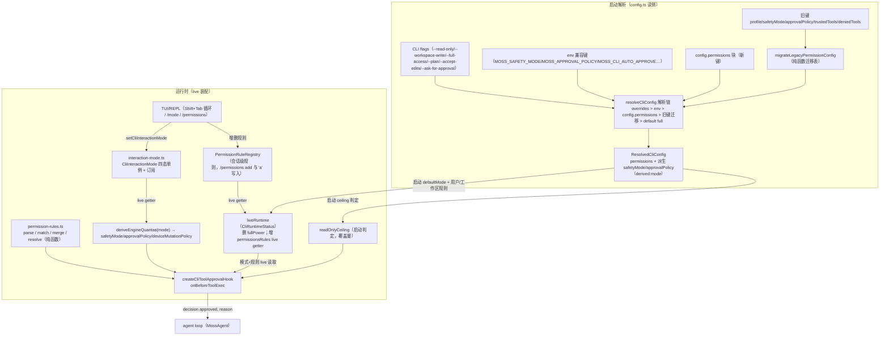
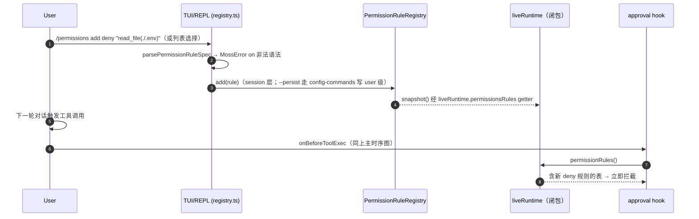
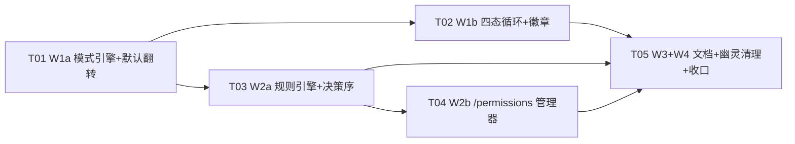

# Moss v0.26 系统架构设计：权限模式引擎 + 规则引擎

> 架构师：高见远（software-architect）。日期：2026-10-08。
> 输入合同：`docs/superpowers/plans/2026-10-08-v026-permission-model.md`（PRD v0.26，7 条拍板决策，
> 不改需求只做设计）。本文所有源码行号基于 v0.25 真实取证。
> 工程纪律基线：`AGENTS.md`（分层 contracts→errors/logger/utils/safety→provider/context/device→core→tools→cli；
> ESLint boundary 规则；MossError with cause；禁 any；先红后绿）。

---

## 1. 实现方案 + 架构图

### 1.1 核心挑战与总体思路

三个真实难点：

1. **「模式」从交互层概念升级为权限引擎的第一轴**：现状 `CliInteractionMode`
   （`src/cli/interaction-mode.ts:2`，三态 `'plan' | 'default' | 'acceptEdits'`）只是 approval hook
   决策序里的一个分支；v0.26 后它派生 `safetyMode`、`approvalPolicy`、`deviceMutationPolicy`
   三个引擎量（PRD「双轴派生而非删除」）。派生必须是**读侧函数**，而不是把三轴散落解析。
2. **规则引擎必须运行中生效**：现状 `cli-main.ts:579-599` 把 `trustedTools/deniedTools` 作为
   启动快照数组传入 hook，`/yolo` 时代的 `fullPower` 走 live getter（`liveRuntime.fullPower`）。
   新规则表必须全部走 live getter（闭包 `liveRuntime` 模式），否则 `/permissions add` 无法
   下一个工具调用即生效（PRD W2）。
3. **决策序收敛**：现状 hook（`approval.ts:980-1145`）的序是
   workspaceBlock → hardBlock → denied → plan → safetyCeiling → trusted → … → fullPower → asker，
   其中 trusted 对 device_mutation 有特判（1045 行）。新序
   **hardBlock > deny 规则 > 模式 ceiling > ask > allow > 交互询问** 要求把规则匹配
   提到 `needsApproval` 短路之前（否则 `read_file(.env)` 这类 readonly 工具的 deny 规则失效），
   并移除 device 的 trusted 特判（被规则系统取代，PRD W2）。

总体架构：**两个纯函数引擎 + 一个 live 装配层**。

- `src/cli/interaction-mode.ts`（改造）：四态枚举 `manual | acceptEdits | plan | full`，
  模式单例 + 订阅者机制保留（TUI repaint 依赖 `subscribeCliInteractionMode`）。
- `src/cli/permission-rules.ts`（新增）：规则解析/匹配/合并/决策序，纯函数、零 src 依赖
  （仅 `micromatch` + `errors.js`），单测友好。
- `src/cli/approval.ts`（改造）：`createCliToolApprovalHook` 装配层——从 live getter 读
  模式与规则表，调 `deriveEngineQuantas` + `resolvePermissionDecision`，保留 headless 拒批、
  asker 分发、boardMode、workspace sandbox 检查。
- `src/cli/config.ts`（改造）：解析链增 `permissions` 块 + 旧键迁移读侧（一张纯函数映射表）；
  `safetyMode/approvalPolicy` 变为**派生输出**（ResolvedCliConfig 字段保留，标注来源
  `derived:mode`），SDK/嵌入 host 兼容。

### 1.2 模式引擎派生表（核心表，实现于 `interaction-mode.ts`）

| 模式          | safetyMode（派生）            | approvalPolicy（派生） | deviceMutationPolicy | acceptEditsEligible | 说明                                             |
| ------------- | ----------------------------- | ---------------------- | -------------------- | ------------------- | ------------------------------------------------ |
| `manual`      | `workspace-write`             | `prompt`               | `ask`（逐次审批）    | false               | `default` token 解析别名                         |
| `acceptEdits` | `workspace-write`             | `prompt`               | `ask`                | true                | 工作区文件编辑自动批                             |
| `plan`        | `workspace-write`（底座不变） | `prompt`               | `deny`（类级）       | false               | 决策走 `isAllowedDuringPlanMode`，保留全部现语义 |
| `full`        | `full-access`                 | `never`                | `allow`              | true                | 跳过 ask，只受 deny 与硬底线约束                 |

两个**模式引擎外**的覆盖量（不参与派生，压过派生结果）：

- **read-only ceiling**（PRD 决策 2）：`--read-only` / `MOSS_SAFETY_MODE=read-only` /
  迁移自 `profile: cautious` 与旧键组合 `read-only`。ceiling 激活时**任何模式**（含 full）
  都拦一切非 readonly 副作用（含 runtime_state——比 plan 更严，W1 spec 钉死两者差异）。
- **boardMode**（`/connect`，现状保留）：PRD 未提，保持现状——board 模式下
  device_mutation/local_write 在安全检查后放行，位置在模式 ceiling 之后、规则 allow 之前。

**关键行为决策（PRD 量化表「manual 模式仍逐次」的落地）**：现状
`isAllowedInMode('workspace-write', 'device_mutation') === false`（`approval.ts:368-387`），
即 manual 等价模式下 device_mutation 被 safety ceiling **硬拦**。v0.26 改为：派生
`deviceMutationPolicy: 'ask'` 的模式下，device_mutation 不再被 ceiling 硬拦，而是**进入
逐次审批询问**；`full` 模式直接放行；`plan` 类级拒绝保留；read-only ceiling 仍硬拦。
`allow` 规则（含 `device_exec(*)`）在 manual 模式可豁免询问——这就是「allow 规则可豁免」。

### 1.3 解析链与 wiring 图



### 1.4 fullPower 退役 wiring 清单

| wiring 位置                                              | 现状                                                                                              | v0.26                                                                                                                                                                          |
| -------------------------------------------------------- | ------------------------------------------------------------------------------------------------- | ------------------------------------------------------------------------------------------------------------------------------------------------------------------------------ |
| `cli-main.ts:577` `liveRuntime`                          | 含 `fullPower` 字段                                                                               | **删 `fullPower`**；其余字段（workspace/config/safetyMode…）保留，增 `permissionsRules?: () => ResolvedPermissionRules` live getter 挂载点                                     |
| `cli-main.ts:594-596`                                    | `safetyModeOverride: () => fullPower ? 'full-access' : undefined`、`autoApprove: () => fullPower` | **删除两个 option**；模式即全开（mode=full → 派生 full-access+never）                                                                                                          |
| `cli-main.ts:597` `interactionMode` getter               | live getter（保留）                                                                               | **升级为唯一模式事实源**：hook 经它读模式并派生引擎量                                                                                                                          |
| `onboarding.ts:27-37,54-66` `CliRuntimeStatus.fullPower` | 字段 + 默认 false                                                                                 | **删除字段**；`runtimeWithDefaults` 同步                                                                                                                                       |
| `args.ts:245` INTERACTIVE_ONLY_COMMANDS `'yolo'`         | 幽灵条目                                                                                          | **删除**（全仓库无 /yolo 实现，`registry.ts` 无该命令）                                                                                                                        |
| `approval.ts` `options.safetyModeOverride/autoApprove`   | 856-863、941、985-990                                                                             | **移除 fullPower 分支**；`CliToolApprovalOptions` 删两字段，增 `permissionRules?: () => ResolvedPermissionRules`、`readOnlyCeiling?: CliSafetyMode \| undefined`（启动判定值） |

不退役的：`boardMode`（`/connect` 通路，独立合法端口）、`persistTrust`（语义升级为写 allow 规则）、
`sessionTrustedWorkspaces`（工作区信任，PRD 未要求改，保留；'a' 的会话信任与规则系统并存，
见 §3.4）。`execWriteRoots`（`cli-main.ts:633`）保持启动快照语义，见 §8-7。

---

## 2. 文件列表及相对路径

新增（3 个 src 文件 + 3 个 spec）：

| 路径                                       | 内容                                                                                                |
| ------------------------------------------ | --------------------------------------------------------------------------------------------------- |
| `src/cli/permission-rules.ts`              | 规则类型、`Tool(pattern)` 解析、operand 提取表、micromatch 匹配、层级安全合并、决策序函数（纯函数） |
| `test/permission-rules.spec.mjs`           | 解析/匹配/合并/优先级/来源并集（先红后绿）                                                          |
| `test/cli-permission-mode-engine.spec.mjs` | 四态派生表、决策序矩阵、read-only ceiling vs plan、迁移映射（先红后绿）                             |
| `test/permissions-command.spec.mjs`        | /permissions 管理命令（默认视图/增删/运行中生效）（先红后绿）                                       |

修改（对齐 PRD 修改范围，可细化不缩水）：

| 路径                                    | 改动                                                                                                                                                                                                                                                       |
| --------------------------------------- | ---------------------------------------------------------------------------------------------------------------------------------------------------------------------------------------------------------------------------------------------------------- |
| `src/cli/interaction-mode.ts`           | 枚举四态（`'default'`→`'manual'` 重命名 + 别名兼容）、派生表 `deriveEngineQuantas`、标签 zh/en 增 full、`inferCliInteractionModeFromMessages` 返回 `manual`                                                                                                |
| `src/cli/config.ts`                     | `ConfigFile.permissions` 块、`migrateLegacyPermissionConfig`、解析链（default full）、`CLI_PROFILE_DEFAULTS` 重构（balanced 档翻为 full 等价、权限字段让位 permissions）、`auditResolvedCliConfig` 重校、`ResolvedCliConfig` 增 permissions + derived 标注 |
| `src/cli/approval.ts`                   | `resolveCliSafetyMode` 兜底翻 full；hook 决策序重构（规则引擎接入、fullPower 移除、device 询问化、'a' 写规则）；`describeCliToolApproval` 增规则量；headless 拒批文案新口径；`isSessionTrustEligible` 由规则系统取代                                       |
| `src/cli/args.ts`                       | 删 `'yolo'`；`--ask-for-approval` 收编 mode 覆盖（清 `on-request`）；safety flags → mode 覆盖 + ceiling 映射；冲突检测扩展                                                                                                                                 |
| `src/cli-main.ts`                       | 默认 wiring（mode 引擎 + 规则 live getter）、fullPower 退役、`execWriteRoots` 按派生 safetyMode                                                                                                                                                            |
| `src/cli/tui/app-helpers.ts`            | `INTERACTION_MODE_CYCLE` 四项、注释更新                                                                                                                                                                                                                    |
| `src/cli/tui/app.ts`                    | shift+tab 分支复用（读 getter 循环，无需改键位逻辑）；`/permissions` 交互面接线（列表选择）                                                                                                                                                                |
| `src/cli/tui/transcript.ts`             | `INTERACTION_MODE_TONES` 四色（full: yellow）、`interactionModeHint` full 无后缀/其余有后缀                                                                                                                                                                |
| `src/cli/tui/copy.ts`                   | zh 文案（full 徽章句式、permissions 管理界面文案）                                                                                                                                                                                                         |
| `src/cli/commands/registry.ts`          | `/mode` 四态帮助（zh/en）；`/permissions` 升级管理命令（add/remove/list 子形态）                                                                                                                                                                           |
| `src/cli/onboarding.ts`                 | `PERMISSIONS_HELP_TEXT` 新口径、`renderCliPermissions` 规则视图重写、`CliRuntimeStatus` 删 fullPower                                                                                                                                                       |
| `src/cli/config-commands.ts`            | `permissions.*` 键 set/unset/validate、旧键写侧同步翻译 + deprecated 提示、`MOSS_ENV_REFERENCE` 文字更新                                                                                                                                                   |
| `src/cli/help.ts`                       | flag 帮助新口径（105-110 行区）                                                                                                                                                                                                                            |
| `src/cli/doctor.ts`                     | deprecated 旧键提示、full 无 deny 守护 info 展示                                                                                                                                                                                                           |
| `src/cli/config-snapshot.ts`            | 展示键增 permissions / 标注 derived                                                                                                                                                                                                                        |
| `src/cli/repl.ts`                       | `/permissions` REPL 行式接线                                                                                                                                                                                                                               |
| `test/cli-permission-defaults.spec.mjs` | 重写：balanced 旧断言 → 迁移语义断言 + 新默认断言                                                                                                                                                                                                          |
| `test/tui-modes.spec.mjs`               | 四态断言（循环、徽章、后缀规则反转）                                                                                                                                                                                                                       |
| `test/tui-registry.spec.mjs`            | /permissions 命令注册更新                                                                                                                                                                                                                                  |
| `test/cli-args.spec.mjs`                | 幽灵 /yolo 清理回归 + flags 新映射断言                                                                                                                                                                                                                     |
| `README.md`                             | 双语「安全与隐私」节新口径                                                                                                                                                                                                                                 |
| `AGENTS.md`                             | 设备子系统节按模式描述改写（110-116 行区），保留工具名契约段                                                                                                                                                                                               |
| `docs/cli-parity/target-spec.md`        | §F9-F11 四态循环、§Z8 注记 `--full-access` 为默认等价物                                                                                                                                                                                                    |
| `docs/release-policy.md`                | v0.26 主张段起草 → 定稿                                                                                                                                                                                                                                    |
| `docs/cli-parity/`（回归面清单）        | v0.23-v0.25 命令族 PTY 取证清单扩展                                                                                                                                                                                                                        |
| `package.json`                          | 0.26.0（W4 收口）                                                                                                                                                                                                                                          |

---

## 3. 数据结构和接口

### 3.1 类型与签名（`permission-rules.ts` / `interaction-mode.ts` / `config.ts`）

```ts
// ── interaction-mode.ts ──────────────────────────────────────────
export type CliInteractionMode = 'manual' | 'acceptEdits' | 'plan' | 'full';
// 'default' 保留为 parseCliInteractionMode 的 manual 别名（含 zh「默认」）
// 会话恢复：旧会话文本 "Left plan mode → default" 推断 → 'manual'

export interface EngineQuantas {
  safetyMode: CliSafetyMode;            // 'workspace-write' | 'full-access'（派生输出）
  approvalPolicy: ConfigApprovalPolicy; // 'prompt' | 'never'（派生输出）
  deviceMutationPolicy: 'ask' | 'allow' | 'deny';
  acceptEditsEligible: boolean;         // 工作区文件编辑自动批
}
export function deriveEngineQuantas(mode: CliInteractionMode): EngineQuantas;
// plan: safetyMode 底座 'workspace-write' 不变；hook 决策走 isAllowedDuringPlanMode（类级）

export function parseCliInteractionMode(raw: string | undefined): CliInteractionMode | null;
// 增 'full' | 'yolo'→不映射（幽灵已删，不新增别名）；'bypass' | 'full' | '自动' | '全开' → 'full'
export function formatCliInteractionModeLabel(mode: CliInteractionMode, zh?: boolean): string;
export function inferCliInteractionModeFromMessages(messages: ReadonlyArray<...>): CliInteractionMode | null;

// ── permission-rules.ts（纯函数，零 src 依赖）────────────────────
export type PermissionLevel = 'allow' | 'ask' | 'deny';
export type PermissionRuleSource = 'user' | 'workspace' | 'session';

export interface PermissionRule {
  level: PermissionLevel;
  toolName: string;          // moss 原生工具名，可含 micromatch glob（如 'device_*'）
  operandPattern?: string;   // 括号内 pattern：匹配主操作数（command / path）；缺省 = 整工具
  source: PermissionRuleSource;
}

export interface PermissionsConfig {           // config.ts 侧的块形状
  defaultMode?: CliInteractionMode | string;   // 默认 'full'
  allow?: string[];
  ask?: string[];
  deny?: string[];
}

export interface ResolvedPermissionRules {
  rules: readonly PermissionRule[];            // 合并后的规则表（deny 并集 + 层级合并）
  sources: { userPath?: string; workspacePath?: string };
}

export interface PermissionDecisionInput {
  toolName: string;
  sideEffect: ToolSideEffectClass;
  operand?: string;                     // 主操作数（exec.command / read_file.path / device_exec.command …）
  requiresApproval: boolean;
  mode: CliInteractionMode;
  readOnlyCeiling: boolean;             // --read-only / MOSS_SAFETY_MODE=read-only 激活
  boardMode: boolean;
}

export type PermissionDecisionOutcome =
  | { decision: 'deny';  reason: string; matchedRule?: PermissionRule }   // deny 规则
  | { decision: 'block'; reason: string }                                  // 模式 ceiling（plan/read-only）
  | { decision: 'ask' }                                                     // 进入交互询问
  | { decision: 'ask-rule'; matchedRule: PermissionRule }                   // ask 规则命中（full 跳过）
  | { decision: 'allow'; reason: 'rule' | 'mode' | 'accept-edits' | 'board' | 'no-approval-needed'; matchedRule?: PermissionRule };

// 核心函数签名（全部可单测）
export function parsePermissionRuleSpec(spec: string, source: PermissionRuleSource): PermissionRule;
// 'exec(npm run *)' → { level 由调用方定, toolName: 'exec', operandPattern: 'npm run *' }
// 'edit_file'       → { toolName: 'edit_file' }（裸工具名 = 整工具）
// 非法（空括号/嵌套括号/空串）→ throwMoss({ code: USER_INPUT_INVALID, hint, context: { spec, source } })

export function extractRuleOperand(toolName: string, input: Record<string, unknown>): string | undefined;
// 主操作数提取表（纯数据映射）：exec→command、device_exec→command、read_file/write_file/edit_file→path、
// device_file_write→path、device_file_read→path、device_deploy→remote_path、move_file→source(+destination)、
// apply_patch→patch 内文件清单（多路径任一命中即算）、其他→undefined（只匹配工具名）

export function matchPermissionRule(rule: PermissionRule, toolName: string, operand?: string): boolean;
// 工具名：findConfiguredToolPattern 同款 micromatch 选项（contains:false, dot:true, noextglob, nonegate）
// operand：micromatch.isMatch(operand, pattern)（前缀通配语义，'npm run *' 匹配 'npm run build'）
// 裸规则（无 operandPattern）→ 只匹配工具名

export function mergePermissionRuleSets(
  userRules: readonly PermissionRule[],
  workspaceRules: readonly PermissionRule[]
): PermissionRule[];
// 安全向合并：deny 跨层级取并集（allow 不能解除另一层 deny —— 匹配期 deny 恒优先，天然满足）；
// allow/ask 同级去重合并；用户显式配置不被工作区克隆仓库放宽（与 mergeConfigFiles 的 user-wins 语义一致）

export function resolvePermissionDecision(input: PermissionDecisionInput, rules: ResolvedPermissionRules): PermissionDecisionOutcome;
// 决策序（唯一实现点，hook 只做装配）：
//   1. deny 规则匹配（任何模式含 full 都赢）
//   2. 模式 ceiling：readOnlyCeiling → block（拦一切非 readonly 含 runtime_state）；
//      plan → isAllowedDuringPlanMode 类级（device_mutation 拒 / readonly 放 / planMode allow 放）
//   3. ask 规则：manual/acceptEdits → 'ask-rule'（询问）；full 跳过（决策 3）；plan 已被 2 拦
//   4. allow 规则 → allow（含 device_mutation，取代 isSessionTrustEligible 特判）
//   5. 模式默认：full → allow(mode)；acceptEditsEligible → allow(accept-edits)；
//      boardMode + board 域副作用 → allow(board)；requiresApproval=false → allow(no-approval-needed)
//   6. 其余 → ask（交互询问；headless 拒批）
// 注意：needsApproval=false（readonly 工具）在 1 之后短路为 allow —— 保证 read_file(.env) 的 deny 生效

// ── config.ts 迁移读侧（纯函数，一张表）─────────────────────────
export function migrateLegacyPermissionConfig(legacy: {
  profile?: string;
  safetyMode?: string;
  approvalPolicy?: string;
  trustedTools?: string[];
  deniedTools?: string[];
}): { defaultMode?: CliInteractionMode; ceiling: 'read-only' | undefined; legacyKeysUsed: string[] };
// cautious→manual+ceiling(read-only)；balanced→manual；autonomous→full
// safetyMode+approvalPolicy 组合：full-access+never→full；read-only→manual+ceiling；其余→manual
// trustedTools→allow 规则（整工具名）；deniedTools→deny 规则
// legacyKeysUsed 供 doctor/config show 提示 deprecated

// ── approval.ts 装配层（CliToolApprovalOptions 变更）────────────
export interface CliToolApprovalOptions {
  approvalPolicy?: ConfigApprovalPolicy;        // 保留（派生量，嵌入 host 可显式给）
  trustedTools?: readonly string[];             // 保留（嵌入 host 兼容；内部翻译为 allow 规则）
  deniedTools?: readonly string[];              // 保留（同上，翻译为 deny 规则）
  workspaceDir?: string;
  device?: { host: string; user?: string; port?: number } | null;
  boardMode?: () => boolean;
  safetyModeOverride?: () => CliSafetyMode | undefined;   // 删除（fullPower 退役）
  autoApprove?: () => boolean;                            // 删除（fullPower 退役）
  interactionMode?: () => CliInteractionMode;             // 保留，升级为唯一模式事实源
  permissionRules?: () => ResolvedPermissionRules;        // 新增：live 规则表 getter（含 session 规则）
  readOnlyCeiling?: boolean;                              // 新增：启动判定 ceiling
  detailMode?: CliDetailMode;
  persistTrust?: boolean;                                 // 保留：'a' 落盘 user config permissions.allow
}
```

### 3.2 类图

```mermaid
classDiagram
  direction LR

  class CliInteractionMode {
    <<enumeration>> manual | acceptEdits | plan | full
  }
  class EngineQuantas {
    +safetyMode : CliSafetyMode
    +approvalPolicy : ConfigApprovalPolicy
    +deviceMutationPolicy : 'ask'|'allow'|'deny'
    +acceptEditsEligible : boolean
  }
  class interaction_mode {
    +deriveEngineQuantas(mode) EngineQuantas
    +parseCliInteractionMode(raw) CliInteractionMode|null
    +formatCliInteractionModeLabel(mode, zh) string
    +setCliInteractionMode(mode) void
    +getCliInteractionMode() CliInteractionMode
    +subscribeCliInteractionMode(l) () => void
    +inferCliInteractionModeFromMessages(msgs) CliInteractionMode|null
  }

  class PermissionRule {
    +level : 'allow'|'ask'|'deny'
    +toolName : string
    +operandPattern? : string
    +source : 'user'|'workspace'|'session'
  }
  class ResolvedPermissionRules {
    +rules : readonly PermissionRule[]
    +sources : { userPath?, workspacePath? }
  }
  class permission_rules {
    +parsePermissionRuleSpec(spec, source) PermissionRule$
    +extractRuleOperand(toolName, input) string|undefined$
    +matchPermissionRule(rule, toolName, operand) boolean$
    +mergePermissionRuleSets(user, workspace) PermissionRule[]$
    +resolvePermissionDecision(input, rules) PermissionDecisionOutcome$
  }

  class ConfigFile {
    +permissions? : PermissionsConfig
    +profile? : string
    +safetyMode? : string
    +approvalPolicy? : string
    +trustedTools? : string[]
    +deniedTools? : string[]
  }
  class config_ts {
    +resolveCliConfig(env, config, overrides, loaded) ResolvedCliConfig
    +migrateLegacyPermissionConfig(legacy) MigrationResult$
    +CLI_PROFILE_DEFAULTS : Record~profile, defaults~
    +auditResolvedCliConfig(config) CliConfigAuditWarning[]
    +mergeConfigFiles(project, user) ConfigFile
  }
  class ResolvedCliConfig {
    +permissions : ResolvedPermissionsView
    +safetyMode : CliSafetyMode (derived from mode)
    +approvalPolicy : ConfigApprovalPolicy (derived from mode)
  }

  class PermissionRuleRegistry {
    -sessionRules : PermissionRule[]
    -listeners : Set~listener~
    +add(rule) void
    +remove(indexOrSpec) boolean
    +list() readonly PermissionRule[]
    +snapshot() ResolvedPermissionRules
    +subscribe(l) () => void
  }

  class CliToolApprovalOptions {
    +interactionMode? : () => CliInteractionMode
    +permissionRules? : () => ResolvedPermissionRules
    +readOnlyCeiling? : boolean
    +boardMode? : () => boolean
    +persistTrust? : boolean
    ~~safetyModeOverride / autoApprove（退役）~~
  }
  class approval_hook {
    +createCliToolApprovalHook(mode, env, options) CliToolApprovalHook
    +describeCliToolApproval(request, mode, env, options) CliToolApprovalPreview
    +resolveCliSafetyMode(argv, env) CliSafetyMode
    -persistAllowRule(preview, toolName)
  }
  class CommandContext {
    +agent : MossAgent
    +runtime : CliRuntimeStatus
    +say(kind, text) void
    +promptInput?(options) Promise~string|null~
    +setInteractionMode?(mode) void
  }
  class commands_registry {
    +permissionsCommand : CommandSpec (add/remove/list sub-forms)
    +modeCommand : CommandSpec (four modes)
    +runRegistryCommand(input, ctx, custom) Promise~boolean~
  }

  interaction_mode ..> CliInteractionMode : uses
  interaction_mode ..> EngineQuantas : derives
  permission_rules ..> PermissionRule : parses/matches
  permission_rules ..> ResolvedPermissionRules : produces
  permission_rules ..> MossError : throws USER_INPUT_INVALID
  config_ts ..> ConfigFile : reads
  config_ts ..> permission_rules : parses permissions 块
  config_ts ..> ResolvedCliConfig : resolves
  PermissionRuleRegistry ..> PermissionRule : session 层
  PermissionRuleRegistry ..> ResolvedPermissionRules : snapshot 合并
  approval_hook ..> interaction_mode : live 模式读取
  approval_hook ..> permission_rules : 决策序调用
  approval_hook ..> CliToolApprovalOptions : wired by cli-main
  commands_registry ..> PermissionRuleRegistry : /permissions 增删
  commands_registry ..> CommandContext : uses
```

### 3.3 模式 ↔ 旧 knob 映射表（flags / env / 旧键统一读侧）

| 输入                                                                                                                           | v0.26 语义                                                                 |
| ------------------------------------------------------------------------------------------------------------------------------ | -------------------------------------------------------------------------- |
| `--full-access` / `--ask-for-approval=never` / `MOSS_CLI_AUTO_APPROVE=1` / `MOSS_APPROVAL_POLICY=never` / profile `autonomous` | mode 覆盖 → `full`                                                         |
| `--plan` / `--accept-edits`                                                                                                    | mode 覆盖 → `plan` / `acceptEdits`（现状已有）                             |
| `--workspace-write` / `--ask-for-approval=prompt` / `MOSS_APPROVAL_POLICY=prompt` / profile `balanced`                         | mode 覆盖 → `manual`                                                       |
| `--read-only` / `MOSS_SAFETY_MODE=read-only` / profile `cautious` / 旧 safetyMode `read-only`                                  | mode → `manual` **+ readOnlyCeiling=true**（决策 2：ceiling 压过任何模式） |
| `--ask-for-approval=on-request`                                                                                                | **报错清理**（幽灵取值，决策 6）                                           |
| 旧 `trustedTools` / `MOSS_TRUSTED_TOOLS`                                                                                       | 翻译为 allow 规则（整工具）                                                |
| 旧 `deniedTools` / `MOSS_DENIED_TOOLS`                                                                                         | 翻译为 deny 规则（整工具）                                                 |
| `MOSS_SAFETY_MODE=workspace-write/full-access`                                                                                 | 按 profile 组合映射规则翻译为 mode 覆盖                                    |

冲突规则：多个 mode 覆盖来源同时出现 → 沿用 `args.ts:347-352` requestSafety 的显式冲突报错模式
（`--plan` 与 `--accept-edits` 互斥已存在，扩展到 mode 覆盖族）。ceiling 与 mode 无冲突
（ceiling 只收紧）。

---

## 4. 调用流程时序图（一次 tool call 的完整决策路径）

```mermaid
sequenceDiagram
  autonumber
  participant Loop as agent loop (MossAgent)
  participant Hook as createCliToolApprovalHook<br/>(approval.ts)
  participant IM as interaction-mode.ts<br/>(四态单例)
  participant PR as permission-rules.ts<br/>(纯函数)
  participant Rules as liveRuntime.rules getter<br/>(user+workspace+session 合并)
  participant Safety as safety 层<br/>(channel-safety/sandbox-paths)
  participant Asker as approval-view / asker<br/>(TUI 或 REPL)

  Loop->>Hook: onBeforeToolExec(request)
  Note over Hook: liveMode 引擎量装配开始
  Hook->>IM: getCliInteractionMode()（instanceInteractionMode ?? options.interactionMode ?? 全局）
  IM-->>Hook: mode = 'manual' | 'acceptEdits' | 'plan' | 'full'
  Hook->>IM: deriveEngineQuantas(mode)
  IM-->>Hook: { safetyMode, approvalPolicy, deviceMutationPolicy, acceptEditsEligible }
  Hook->>Rules: permissionRules()（live getter，闭包 liveRuntime —— 不做启动快照）
  Rules-->>Hook: ResolvedPermissionRules（deny 并集 + 层级合并 + session 规则）
  Hook->>PR: extractRuleOperand(tool.name, request.input)
  PR-->>Hook: operand（exec.command / read_file.path / device_exec.command …）
  Hook->>Safety: workspaceMutationBlockReason（assertSandboxPath 路径逃逸）+ isCommandDangerous
  Safety-->>Hook: hardBlockReason?（危险命令 / 路径逃逸）
  alt hardBlock 命中
    Hook-->>Loop: { approved: false, reason: hardBlock }（任何模式不可绕过）
  end
  Hook->>PR: resolvePermissionDecision({ toolName, sideEffect, operand, mode, readOnlyCeiling, boardMode }, rules)
  alt deny 规则命中（含 full）
    PR-->>Hook: { decision: 'deny', matchedRule }（deny > 一切模式）
    Hook-->>Loop: { approved: false, reason: blocked by deny rule (source) }
  else readOnlyCeiling / plan 类级 ceiling
    PR-->>Hook: { decision: 'block', reason }
    Hook-->>Loop: { approved: false, reason: read-only ceiling / plan mode }
  else ask 规则（manual/acceptEdits）
    PR-->>Hook: { decision: 'ask-rule', matchedRule }
  else allow 规则 / full / acceptEdits / board / no-approval-needed
    PR-->>Hook: { decision: 'allow', reason }
    Hook-->>Loop: { approved: true }
  else 兜底
    PR-->>Hook: { decision: 'ask' }
    alt 非 TTY 且无 asker（headless）
      Hook-->>Loop: { approved: false, reason: 新口径指引 /mode full、--full-access }（一次性提示）
    else TTY
      Hook->>Asker: viewAsker(buildCliApprovalView(dialog)) / asker(prompt)
      Asker-->>Hook: 'y' | 'a' | 'amend' | ''（n/esc）
      alt 'a'（don't ask again）
        Hook->>Rules: PermissionRuleRegistry.add({ level: 'allow', toolName, source: 'session' })<br/>+ persistTrust 时写 user config permissions.allow
        Note over Rules: 下一个工具调用即生效（live getter）
      end
      Hook-->>Loop: { approved: true/false }
    end
  end
```

/permissions 与 Shift+Tab 的运行中改规则路径：



---

## 5. 任务列表（对齐 PRD W1-W4，先红后绿，每批独立过 `npm run verify`）

| ID      | 名称                                              | 涉及文件                                                                                                                                                                                                                                                                                                                                                                               | 依赖    | 验收（spec / 门）                                                                                                                                                                                                                   |
| ------- | ------------------------------------------------- | -------------------------------------------------------------------------------------------------------------------------------------------------------------------------------------------------------------------------------------------------------------------------------------------------------------------------------------------------------------------------------------- | ------- | ----------------------------------------------------------------------------------------------------------------------------------------------------------------------------------------------------------------------------------- |
| **T01** | **W1a 模式引擎 + 默认翻转 + 迁移读侧**            | `src/cli/interaction-mode.ts`、`src/cli/config.ts`、`src/cli/approval.ts`（resolveCliSafetyMode 兜底 + options 类型变更）、`src/cli/args.ts`（flags→mode 映射 + on-request 清理）、`src/cli-main.ts`（默认 wiring 骨架）、`test/cli-permission-mode-engine.spec.mjs`（新增，先红）、`test/cli-permission-defaults.spec.mjs`（重写）                                                    | 无      | `npm run test:filter -- --filter cli-permission-mode-engine` + `--filter cli-permission-defaults`；四态派生表断言、旧键迁移映射断言（cautious/balanced/autonomous/组合/trustedTools/deniedTools）、新默认 full 断言、SDK 快照零变更 |
| **T02** | **W1b 四态循环 + 徽章 + audit 重校**              | `src/cli/tui/app-helpers.ts`、`src/cli/tui/transcript.ts`、`src/cli/tui/app.ts`、`src/cli/tui/copy.ts`、`src/cli/commands/registry.ts`（/mode 四态）、`src/cli/config.ts`（auditResolvedCliConfig 重校 + 一次性会话提示去重）、`test/tui-modes.spec.mjs`（重写）、`test/tui-registry.spec.mjs`（更新）                                                                                 | T01     | `--filter tui-modes` + `--filter tui-registry`；Shift+Tab 四次循环四态、full 黄 ⏵⏵ 无后缀、非默认态有 `(shift+tab to cycle)`、read-only ceiling vs plan 差异钉死、默认 full 无 deny 时一次性提示                                    |
| **T03** | **W2a 规则引擎 + 决策序接入**                     | `src/cli/permission-rules.ts`（新增）、`src/cli/approval.ts`（决策序重构：规则先于 needsApproval 短路、fullPower 移除、device 询问化、'a' 写规则）、`src/cli-main.ts`（规则 live getter wiring）、`test/permission-rules.spec.mjs`（新增，先红）、`test/cli-permission-mode-engine.spec.mjs`（决策序矩阵扩展）                                                                         | T01     | `--filter permission-rules` + `--filter cli-permission-mode-engine`；Tool(pattern) 解析、operand 匹配、deny 跨层级并集、决策序矩阵（deny>模式>ask>allow、full 跳 ask、read_file(.env) deny 在 full 下仍拦）、headless 拒批新口径    |
| **T04** | **W2b /permissions 规则管理器 + 配置写侧**        | `src/cli/commands/registry.ts`（/permissions add/remove/list）、`src/cli/onboarding.ts`（renderCliPermissions 规则视图 + PERMISSIONS_HELP_TEXT）、`src/cli/config-commands.ts`（permissions.\* set/unset/validate + 旧键写侧翻译）、`src/cli/repl.ts`、`src/cli/tui/app.ts`（列表选择接线）、`test/permissions-command.spec.mjs`（新增，先红）、`test/tui-registry.spec.mjs`（再更新） | T03     | `--filter permissions-command`；默认视图（defaultMode + 三级计数 + 来源）、增删规则下一调用生效、zh/en 双语、config set 旧键 deprecated 提示                                                                                        |
| **T05** | **W3+W4 文案/文档叙事反转 + 幽灵清理 + 发布收口** | `README.md`、`AGENTS.md`、`docs/cli-parity/target-spec.md`、`docs/release-policy.md`、`src/cli/help.ts`、`src/cli/doctor.ts`、`src/cli/config-snapshot.ts`、`src/cli/args.ts`（删 'yolo'）、`src/cli-main.ts`（fullPower 退役收尾）、`src/cli/onboarding.ts`（fullPower 字段删）、`test/cli-args.spec.mjs`、`docs/cli-parity/`（回归面清单）、`package.json`                           | T01-T04 | `--filter cli-args`；`npm run verify` 全绿 + `npm run examples` 三例实跑 + PTY/headless 双语取证（PRD 验收门 7/8）+ `git status --short` 只含本会话改动 + 0.26.0 + tag                                                              |

依赖图：



T02 与 T03 并行可行（T03 只依赖 T01 的四态枚举与派生函数）；T05 必须最后（叙事诚实性依赖行为全部落地）。

---

## 6. 依赖包列表

**预计零新增。**

- `micromatch@^4.0.8`（已有，`package.json:40`）：规则工具名 + operand 匹配，复用
  `findConfiguredToolPattern`（`approval.ts:835-850`）的同款选项
  （`contains:false, dot:true, nocase:false, noextglob:true, nonegate:true`——工具名匹配；
  operand 匹配用 `micromatch.isMatch(operand, pattern)` 前缀通配语义）。
- 其余（ink/react/picocolors/ssh2/string-width/turndown/undici）均无新增需求。
- **不引入** glob 解析库（`parsePermissionRuleSpec` 的 `Tool(pattern)` 语法用正则切分即可，
  pattern 本身交给 micromatch——不重造轮子也不引入新依赖）；不引入 i18n 框架（PRD Non-goal）。

---

## 7. 共享知识（跨文件约定）

1. **permission-rules.ts 分层归属：`src/cli/`（不是 src/safety/）**，论证：
   - `src/safety/index.ts` 被 `src/index.ts:13` `export *` 进 SDK 公共面——permission-rules 若挂
     safety 层并导出，就进入 semver 契约面，违反 PRD「SDK 快照零变更」；放 `src/cli/`
     （SDK 不导出 approval/interaction 层，已核实 `src/index.ts` 无相关导出）天然隔离。
   - 依赖闭包：规则解析需要 `ConfigFile`/`CliInteractionMode` 类型与 user/workspace 来源语义
     （全在 cli 层）；放 safety 层要么下沉类型（扩大 contracts 面）要么破坏纯度。
   - 边界方向：cli → safety 合法（approval.ts 现有 `isCommandDangerous/assertSandboxPath`
     import 既有边界），permission-rules 放 cli 零新增违规；反之 safety 层要引 cli 类型才是违规。
   - 语义定位：src/safety 是「工具执行硬防线」（危险命令/沙箱路径/秘密消毒），权限规则是
     「用户策略表达层」——语义不同层。纯函数属性通过**零 src import**（仅 micromatch + errors）
     保证可测试性，与放哪层无关。
2. **新文件 kebab-case**：`permission-rules.ts` ✓；ESM 相对导入带 `.js` 后缀；
   仅类型导入 `import type`（`verbatimModuleSyntax: true`）；禁 `any`、禁 `catch (err: any)`。
3. **错误规范**：规则解析失败 `throwMoss({ code: ErrorCode.USER_INPUT_INVALID, message,
hint, context: { spec, source } })`；配置读入路径的坏 JSON 沿用 `CliConfigFileError`
   （config-errors.ts 现有模式，不改动其形态）；跨边界保留 cause。
4. **决策序唯一实现点**：`resolvePermissionDecision`（permission-rules.ts）是决策序的唯一
   权威实现；approval hook 只做装配（取 live 模式/规则/ceiling），不得在 hook 内散落顺序判断。
   规则匹配发生在 `needsApproval` 短路**之前**（deny 对 readonly 工具必须生效）。
5. **live getter 纪律**：模式与规则表一律经闭包 getter 读取（`instanceInteractionMode ??
options.interactionMode ?? getCliInteractionMode()`；`options.permissionRules?.()`），
   禁止启动快照数组。`liveRuntime`（CliRuntimeStatus）是唯一挂载点，`/permissions` 与 `'a'`
   的 session 规则经 `PermissionRuleRegistry` 写入、经 live getter 被 hook 读到。
6. **zh/en 双语**：所有新用户可见文案走 `isZhLocale()`（cli 层）/ `isTuiZh()` + `tui()`（TUI 层
   copy.ts 模板表）三元分支，参照 registry.ts `/mode` 与 mcp-commands.ts 的既有双面模式；
   不引入 i18n 框架。徽章 zh 文案同步 `tui('⏸ {label} mode on')` 形态。
7. **`'default'` → `'manual'` 重命名的兼容面**：`parseCliInteractionMode` 保留 `default`/`d`/
   `normal`/`默认` 为 `manual` 别名（PRD 明确）；`inferCliInteractionModeFromMessages` 的
   历史文本推断返回 `manual`（老会话的 default 语义即 manual）；所有
   `Record<CliInteractionMode, …>` 映射表（TONES/CYCLE/label）同步改键——tsc exhaustive
   check 保证不漏。
8. **SDK 面与嵌入兼容**：`src/index.ts` 不导出 approval/interaction 层（已核实），
   `test/sdk-contract.spec.mjs` 快照零变更；`examples/custom-tool-approval.mjs` 走 core hooks
   不受影响；`CliToolApprovalOptions` 保留 `trustedTools/deniedTools/approvalPolicy` 字段
   （嵌入 host 兼容），内部翻译为规则表参与决策（旧字段语义不变：整工具 allow/deny）。
9. **`execWriteRoots` 启动语义**：`cli-main.ts:633` 按启动派生 safetyMode 决定
   （full → 不设 exec 写根），运行中 /mode 收紧**不**追溯收紧 exec 沙箱根——已知限制，
   文档注明（见 §8-7）。
10. **spec 命名**：新 spec 文件名含被测模块名（`--filter` 可命中）；
    测试 import `dist/`；先红后绿；被翻转的旧断言同 commit 改写并注明决策来源
    （PRD 验收门 1）。
11. **git 纪律**：禁 `git add -A`；`git status --short` 收工前只剩本会话改动；
    tag 仅在证据齐后打（release-policy）。

---

## 8. 待明确事项（PRD 未覆盖 / 需主理人确认的点）

> **裁决记录（2026-10-08，主理人/团队，全部生效）**：1-3 及 5-8 按架构师推荐执行；
> 第 4 条留给 Engineer；第 8 条确认为有意决策并向用户通报。以下原文保留作背景。

1. **`--ask-for-approval` 与 mode 覆盖族的冲突语义**：PRD 决策 6 收编为 mode 覆盖，但
   `--ask-for-approval=never` 与 `--plan` 同时出现时（一个推 full 一个推 plan）应报错还是
   后者赢？本设计按 `args.ts:347-352` 既有 requestSafety 模式取**显式报错**——待确认。
2. **'a'（don't ask again）产生的规则粒度**：PRD 说「写一条 allow 规则（含 device_exec）」但未
   定粒度。现状 `persistTrustedTool` 是整工具名（`exec` 全放行含 rm）。本设计保持**整工具**
   粒度（行为持平、实现最小），operand 级（如 `exec(npm run *)`）留给用户手动经 /permissions
   添加——是否要在 v0.26 顺手把 'a' 升级为 command 前缀粒度（F18 诉求）待确认。
3. **defaultMode 的 env 键缺失**：PRD env 键去向只定义了旧三键兼容覆盖，未给新键
   （如 `MOSS_PERMISSIONS_MODE`）。本设计**不新增** env（避免 `moss config env` 双向扫描锁
   扩面 + 决策面最小化），defaultMode 只经 config/flags——待确认是否接受。
4. **`/permissions` TUI 列表选择的具体形态**：PRD 说「TUI 列表选择 + REPL 行式命令两种面，
   共用一个注册表命令实现」。本设计 CommandContext 已有 `promptInput`（行式），TUI 列表
   复用 approval/question 分支的选项渲染骨架（非重写审批 UI，PRD Non-goal）。实现细节
   （是否复用 palette.ts）留给 Engineer，不构成设计缺口。
5. **`sessionTrustedWorkspaces`（工作区信任）与新规则系统并存**：PRD 未提及现有 'a' 的工作区
   级信任（`sessionTrustedWorkspaces`）去留。本设计保留（行为不变），仅把 tool 级信任换成
   session 规则——若主理人希望统一为规则（`allow edit_file(workspace 内)` 形态）需另立决策。
6. **audit 一次性提示的去重边界**：决策 7 说「会话级去重，不落盘」。本设计在 CLI 会话层
   （cli-main 启动后首条）以内存布尔去重——`moss --print` 一次性进程里提示一次、常驻会话
   提示一次，符合字面；但 doctor/config show 的展示形态（info 级）与 PRD「或降为 info 级
   doctor 展示」二选一，本设计取**两者都做**（audit 返回 info 级 warning + 会话层一次性提示）。
7. **execWriteRoots 不可运行中收紧**（§7-9）：PRD 未覆盖。接受为已知限制并在 README/help
   注明，还是 v0.26 顺手把 execWriteRoots 变 live（需要 MossAgent 构造参数改造，侵入 core）？
   本设计建议**接受限制**（Non-goal 边界：不动 core 层）。
8. **`device_mutation` 从硬拦改为询问的行为放宽确认**：PRD 量化表「manual 模式仍逐次」隐含
   此变化（现状 workspace-write ceiling 硬拦 device_mutation），但 PRD W1 硬底线清单未显式
   列出「放宽」。本设计按量化表执行（manual/acceptEdits → ask），spec 锁定——提请主理人
   知悉这是一处**语义放宽**而非纯对齐。
