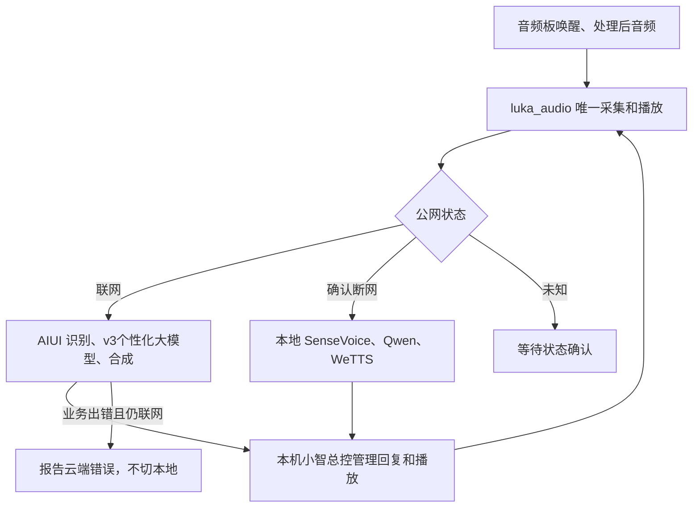

# S100 小智总控：联网 AIUI，断网本地

基于 D-Robotics/xiaozhi-in-rdk 固定提交 ade6cd1 改造，保留MIT许可。
默认入口及 `--ros-speech` 都进入本机ROS会话总控。原上游仅通过
`--upstream-reference` 显式运行作参考，不是部署入口。

## 当前规则

| 网络状态 | ASR | 对话与个性化回复 | TTS |
| --- | --- | --- | --- |
| online | AIUI | AIUI v3云端 | AIUI |
| offline，确认公网不可达 | 本地RDK SenseVoice | 本地Qwen2.5-1.5B-Instruct（官方OELLM/BPU） | 本地RDK WeTTS |
| unknown，尚未确认/状态过期 | 等待或报告错误 | 等待或报告错误 | 等待或报告错误 |

联网时，云端认证、配置、权限、限流或服务错误直接报告，不触发本地推理补答。
真正失去公网后才允许本地链路；公网恢复后的后续请求自动回到AIUI。
机器人任务执行与安全门在本机ROS2，当前语音动作下发仍关闭，尚未迁入自动导航工具。



联网音频识别和合成沿用已验证的厂商ARM SDK通路；个性化大模型使用AIUI官方
`wss://aiui.xf-yun.com/v3/aiint/sos`。全部业务推理提供方均为AIUI，S100负责采集、
前端VAD、会话管理、解码播放和ROS2执行。本模式不连接小智公共云、OTA或MQTT/UDP。

## 启动教程

Windows PowerShell：

```powershell
ssh sunrise@192.168.3.150
```

机器人终端：

```bash
sudo systemctl start luka-ws-xiaozhi.service
source ~/luka_ws/src/system/environment.bash
ros2 topic echo /voice/status
```

另开一个终端可看回答：

```bash
source ~/luka_ws/src/system/environment.bash
ros2 topic echo /xiaozhi/answer
```

说“露卡”，听到短提示音后提问。只说唤醒词不生成回答。
当前连说尚无预录缓存，真实现场唤醒整轮仍需验收。
回答角色沿用AIUI应用的云端个性化配置；本次实测该应用回复为“小丸子”。
服务已设置开机启动，依赖voice服务。确认断网后的首次对话按需启动本地chat服务，
冷启动等待最多60秒；启动前要求至少768MiB可用Linux内存，同时满足BPU保留区门槛，不足时报告错误。
联网空闲后，只释放本总控启动的模型实例；已有外部实例和活动HTTP客户不被停止。
联网请求不调用本机Qwen，也不再主动加载本地模型待机。

```bash
ros2 topic echo /xiaozhi/status
ros2 topic pub --once /voice/control std_msgs/msg/String '{data: "cancel"}'
sudo systemctl restart luka-ws-xiaozhi.service
sudo systemctl stop luka-ws-xiaozhi.service
```

当前半双工。取消会清理待播报文字，并终止云端请求/当前播放；本地共享HTTP模型请求
取消后丢弃结果，不强制关闭整个模型服务。回复过程中再次提出问题会报告busy。

## 网络判定与配置

`luka_audio` 独占公网监测，通过AIUI和独立公网站点的TCP连接探测可达性，
一次成功进入online，连续两轮都失败才进入offline；超过10秒未更新进入unknown。
网络可达与云服务鉴权分别判断，HTTP403或NLP错误不会被直接认定为断网。
此规则描述公网可达性，不把“Wi-Fi已连接”或“能Ping机器人”当作云服务成功。
`/voice/status.network_state` 每秒发布，小智读取同一新鲜状态决定对话后端。

AIUI凭据仅在 `~/.config/luka_audio/aiui.cfg`，权限600。
会话配置在 `~/.config/luka_xiaozhi/config.json`，权限600，当前 `dialogue_mode=auto`。
音频配置保持 `LUKA_AUDIO_MODE=auto`。手动local/rdk标签不再绕过公网判定。
模型与记录分别在 `~/luka_data/ml_models`、`~/luka_data/runtime`，不进入Git。
本地LLM接口为 `http://127.0.0.1:8092/v1/chat/completions`，模型别名qwen2.5-1.5b-instruct-bpu。

## SDK与接口版本核实

供应商三个资料包和机器人安装库SHA256相同，实际SDK版本为6.6.0001.0047。
旧资料对 `20001, sub=nlp` 的默认关闭说明适用于其旧链路；该错误不能证明此应用没有
云端大模型能力。实测同一凭据v2返回NLP无效参数错误，v3成功生成个性化回复。
SDK6.6不支持aiui_ver=3，不能仅改SDK配置解决；本实现使用平台官方v3 WebSocket接口。

官方依据：

- https://aiui-doc.xf-yun.com/project-1/doc-584/ （v3交互API）
- https://aiui-doc.xf-yun.com/project-1/doc-405/ （鉴权）
- https://aiui-doc.xf-yun.com/project-1/doc-769/ （新旧应用与链路说明）

## 构建与验收

```bash
source ~/luka_ws/src/system/environment.bash
cd ~/luka_ws
MAKEFLAGS=-j1 colcon build --base-paths src --packages-select luka_audio luka_xiaozhi --parallel-workers 1
colcon test --packages-select luka_audio luka_xiaozhi
```

音频15项Python测试、小智26项Python测试以及C++错误分类检查已通过。
覆盖在线故障不降级、确认断网才本地、未知网络不降级、恢复、取消、鉴权签名、
过期回复、历史限额、控制JSON过滤、分句、默认入口不加载原公网客户端和模型释放所有权。
真人唤醒、连说、工具执行与并发压力结果不得用回放代替；详见ACCEPTANCE.md。

2026-10-08本地后端已切换到官方OELLM 1.0.0和Qwen2.5-1.5B-Instruct，实测S100 V1P1。
BPU carveout=2.25 GiB，Linux总内存约7.6 GiB；新的隔离断网录制音频回归三轮通过。
详见oellm_server/README_LUKA.md；编译上下文1024，官方server的逐请求max_tokens限制尚未实现。
